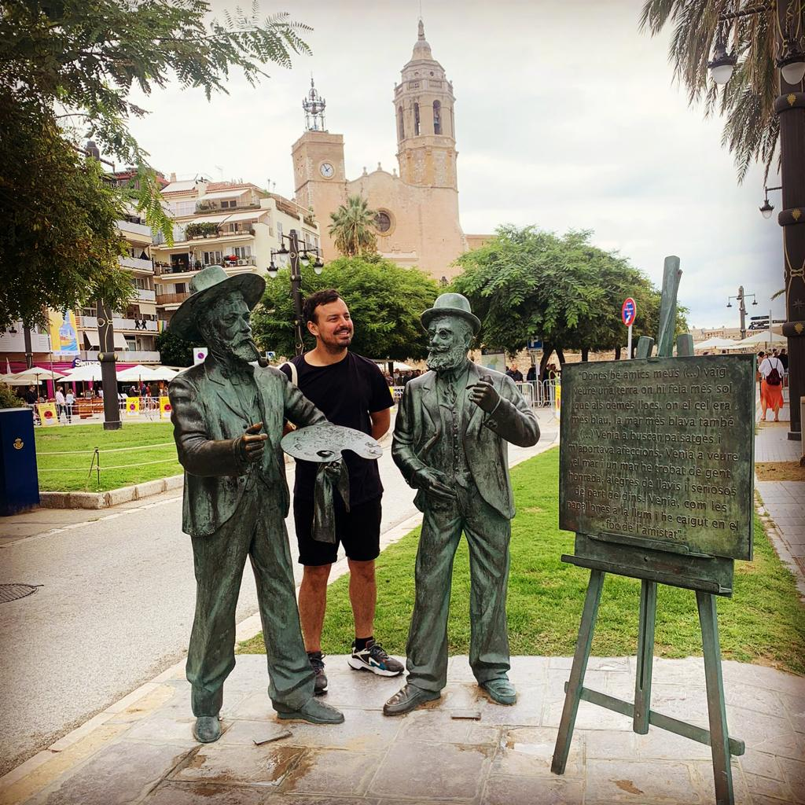

# About

I am José Hirmas Stark. Born in Santiago de Chile (1987)
Chilean. Social entrepreneur. Business designer. Educator.

Grandson of immigrants: Palestinian descent from my father, Hungarian from my mother. 

Interested in:

- the power of human relationships for educational development and justice
- designing business projects that generate positive social outcomes
- theater and acting as a communicational tool for developing your attitude
- good food and craft beer taster

### The arrival: 
> ## “Caminante no hay camino, se hace camino al andar”

I arrived at Barcelona on Friday 17 Sept 2021, after leaving Chile where I have worked and lived all my life. This first weekend was to settle out, go around the city, explore some typical places and be prepared for class. My feelings are anxiety, surprise, and happiness, preparing for new learnings and the MDEF experience.

The Best: the city multicultural vibe and food.
The Challenges: Explore the city 

