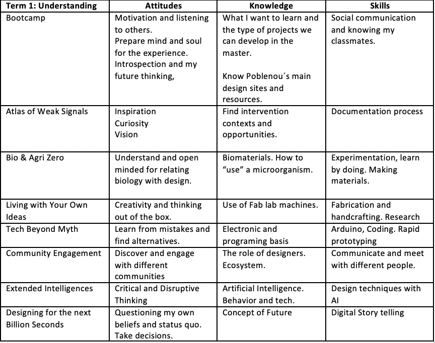
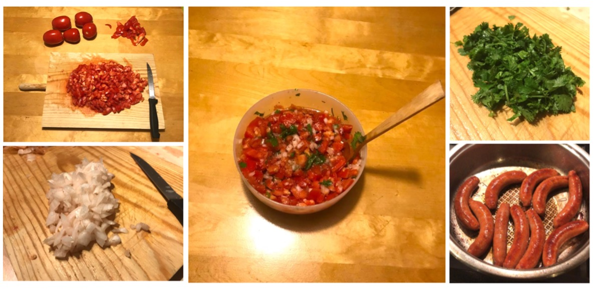
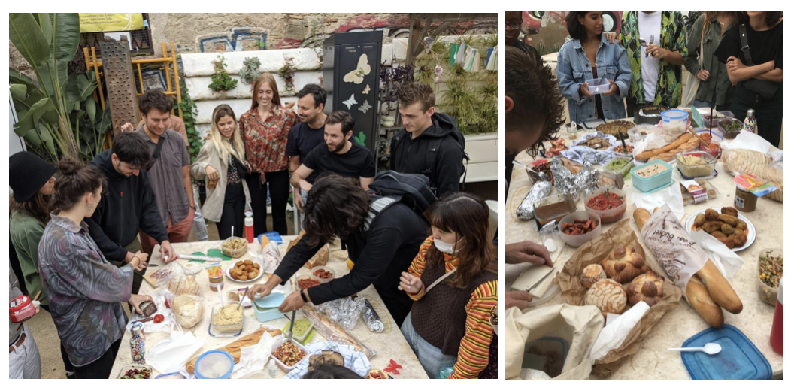
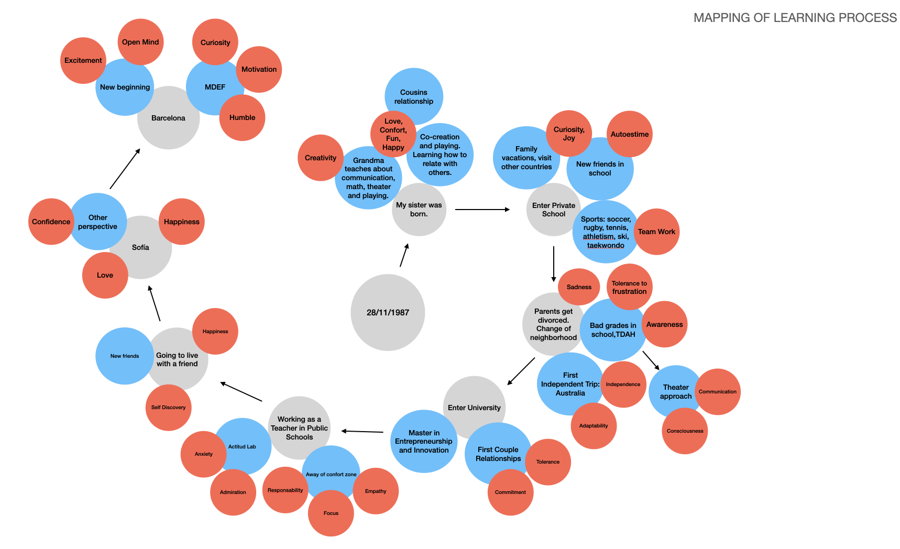
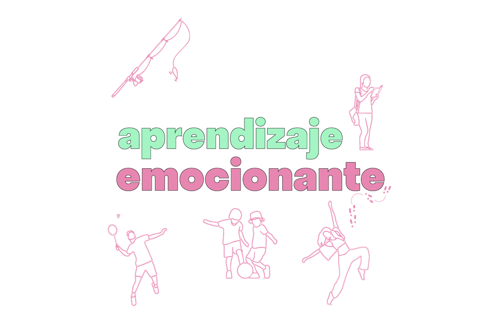
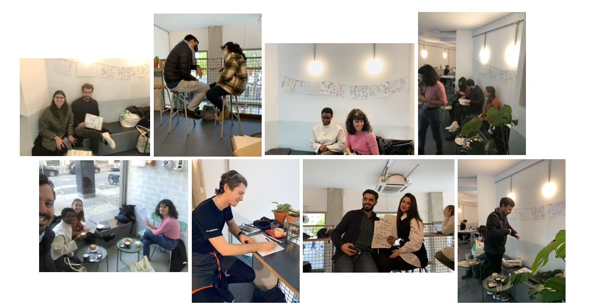
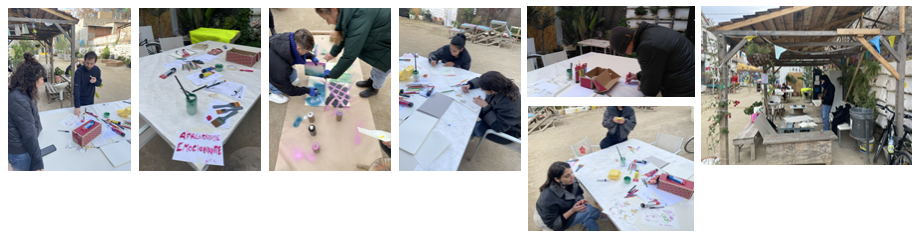
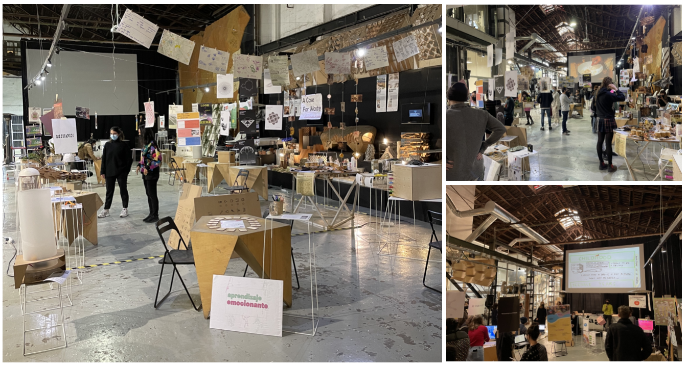

---
hide:
    - toc
---

# Design Studio 1

### Design vision of how our (social) world could be in the (near) future:

My vision is to generate spaces for human relations and their educational and social development, empowering in the need of being part of something, accepting each others realities, empathizing, sharing and creating community as a main concept.

### Personal Development Plan

 

### What I want to learn and develop?

 

### My New Me

To construct my design and creativity attitude I got really inspired by Nasa´s I.S.R.U (In Situ Resource Utilization) and I am applying some methods that artist Tom Sachs defined as part of his creative way: output first thing in the morning, do what you love, setup is everything, start easy, patience, forgive yourself of perfectionism, make to do lists. 

### Experiment: Positive Foods Lunch

Role of Prototyping: Means of Enquiry
The purpose of this experiment was to explore the relationship between food and emotions for people.  Also to explore “making” food as a process and the changes in the materials (shape, color, taste, etc) when cooking.

I invited everyone in the class to bring their foods to share with these indications:

I choose to make **Choripan con Pebre**: this is a traditional Chilean informal dish that we use to eat in barbeques, when gathering with friends and for celebrating important dates (such as the Independence Day). The plate is composed of: Bread, Chorizo, and the sauce called pebre has tomato, onion and cilantro.

The day of the experiment almost all the class participated, many exciting faces and positive comments about the idea. There was a lot of different food!

Meanwhile everyone was eating and sharing I made some short interviews just to know the feelings and thoughts about this food experience. 

<iframe width="560" height="315" src="https://www.youtube.com/embed/qH2-d3UDoYI" title="YouTube video player" frameborder="0" allow="accelerometer; autoplay; clipboard-write; encrypted-media; gyroscope; picture-in-picture" allowfullscreen></iframe>

Conclusions:

-   Everyone related their food to some special memory of their local town/city. It was surprising that almost everyone brought something of their country.
-   During the experience you feel “the joy energy” surrounding us. Also the sense of community and the “sharing” took place as the key element of the experience. 
-   Food produces happines ? I will have to explore types of food and what produces in organism (serotonine, dopamine).
- Many people asked me if we are going to repeat this experience, as a tradition. 

### My Interests

After sharing interests with my classmates, we were grouped together in "Unlearning to Learn", talk about experiments, ideas and new "to do things". It was very good seeing the touchpoints we have with each other:

This week I get really empowered with Ron Wakkary's seminar about post human centered design, specially with the concept of **"design with"** which makes me wonder about how my design project has to be developed with relationality between humans and things. 

We don´t design alone, we need to negiotate with others.

### Documentation beyond Presentation

When documenting we represent the world with our own perception. In this way, documentation is not apart from our 1PP but is part of the process. 

Through my experience, I have been with "my senses open for exploration". The tools I am using to document are very simple: notebook, pen and phone (for pictures and videos). In my notebook I use to make visual maps of the concepts and ideas. 

I am experimenting in the documentation process by paying attention to the words and concepts that everyone use in my sorroundings. This has make me focus in language and word usage to understand what is happening around. I am using my notebook to write the exact sentences of the concepts and ideas that I want to capture. So everyday I have between 5 - 20 phrases of people (including my own sentences). This sentences are transformed into quotes. 

The text input is cronologically captured transforming sentences into small "quote stories". Each sentence has a choosen word or concept that is used for making a final quote of the story. 

The result is an abstract, deep and poetic set of quotes summarizing the documentation process.

<iframe width="560" height="315" src="https://www.youtube.com/embed/oPLxU-qrUXc" title="YouTube video player" frameborder="0" allow="accelerometer; autoplay; clipboard-write; encrypted-media; gyroscope; picture-in-picture" allowfullscreen></iframe>

The video shows 7 different "quote stories", each one is an act that can be interpreted in any way. Sound is used as a complementary tool to guide the viewer and help in the imagination of new realities. 

Insights of this experience:

- Context always affects the words and sense of language. Sound is a complementary tool for creating new realities.
- Writing notes is not efficient for capturing all the moments, but it makes me aware of every single word. When writing a note you inmediatelly take the phrase of its context and can play with it. 
- Organizing the documentation as a theater act (actor and producer) is a good way of self-communication and made me understand better the personal process in first person perspective.

### Collective Design Intervention

As part of the “Unlearning to learn” group, we had the assignment of designing a collective intervention. 

During the last weeks we start sharing our personal interests and trying to define a collective challenge. After exposing my own interests with the group (process of fabrication, human’s relations and what they feel, new ways of education and food culture), everyone exposed their interests too and we analyze and connect them to a group challenge. 

At the same time, we started contacting different people, exposing our ideas and concerns, with an open attitude and active listening. Many lessons and some insights appeared in the way.

Meeting with Kate:

- Learning versus the education system.
- We have different approaches about learning (lets frame it)
- Set the playground of our intervention: why, what, how, where

Meeting with Clement :

-   Prepare well formulated questions. Simple language for involving the community
-   Design a intervention to be fun (for social attraction)
-   Input-Output-Outcome-Impact
-   Look events and make the intervention there

Visit to Can Batlló:

-   The intervention can be made in an open space.
-   What about graffiti as a tool for expression?
-   Examples of organized communities and cooperatives. 

After discussing and sharing experiences, we decided this as our collective challenge:

> We studied in systems created by the needs of previous generations and led by them. Today's needs changed and the hierarchy in teaching and learning should change as well. How can we change what we learn and how we learn it?, How can we create new ways of learning, by raising our voice and showing our needs?, How can we be aware of those needs?

This is the *first map of my learning process*, which I shared with our group. I started putting out the day I was born. From this I thought about important moments in my life (grey circles) and related to learning moments (blue circles), focusing in the emotions and feelings of that learning experience(red circles).

From this moment on,**APRENDIZAJE EMOCIONANTE** emerged. 

#### What is it?
Exploration about different ways of learning of people in Barcelona, by collecting their individual learning paths. We invited people to draw a map of their learning journey and thell us the story behind key moments. 

##### How do we imagined it?
People will draw their personal learning maps and make a reflection about it. After that they will choose one lesson of their own map and make a drawing or painting of an emotion or feeling that resume the experience. All the drawings will be hanged and exhibit in an open space for people getting inspired with other´s stories.

##### Prototyping the Activity

The *first prototype* of the activity was with some chilean and italian friends at my house, where after talking about our own learning experiences in barcelona, I asked them to draw their learning paths and after some minutes we shared these between us. I also shared my own experience and learning path.

Insights: 

- When I expose myself to others, others also expose themselves. It is a way of creating horizontal relationships. 
- The exercise is an excuse for people start telling their life story.
- The time is important for everyone to get a deep reflection and really connect with the work.
- The space is crucial: we were having some drinks in a cozy and intime scenario.

The *second prototype* of the activity was during lunch time with two classmates. The scenario was a table in a nice sunny terrace, after going to Materfad and discover amazing biomaterials. The conversation was very intime and emotional, talking about prorities in life and concerns about relationships. 

Insights: 

- After sharing I asked them to resume all this work in one word. This was going to be very powerfull for our exhibition and how we communicate our intervention. 
- Small groups generate a intime atmosphere where conversation is much deep. 

#### The Intervention

After sending some emails to places we thought would be good for our intervention, finally decided to make it in Three Marks Coffee, because they liked the idea! We arrived to the coffee shop early and it was closed, but after some time waiting they opened and we saw the space. At first we were nervous and a bit shy, did not know how to start or in which part of the space to set all things. We had some coffee and prepare ourselves, choosing second floor as the best space to make the intervention.

and we wait for people...

Inspired by the vibe I sat on a chair and start making again my own learning path:

Insights: 

- We meet people from different backgrounds and cultures that tell us their learning journeys and some life experiences. (Example: Saudi arabian couple in honey moon told their story)
- New opportunities of intervention raise (Example: there is a teacher that wants to do this with his students)
- People gets inspired by the intervention (Example: a guy told us that he will present his learning path as part of his PhD)

#### The Second Intervention

We planned to do an open space intervention in Mariposa Park. The idea was to explore with other materials and painting tools, giving people the freedom to use whatever they wanted. 

Insights: 

- Not many people came. It was a cold day, and the people that was in the park wanted to relax and did not participate. 

- We had some classmates that participated, but very fast because of time. They did not used any special material that we had brought (only paper and pencil).

- Grafitti painting was introduced by Nikita in his own learning map.

<iframe src="https://player.vimeo.com/video/682893774?h=2c6d5143e3" width="640" height="564" frameborder="0" allow="autoplay; fullscreen" allowfullscreen></iframe>

#### Why the intervention was important for me?

- Understand others learning paths and backgrounds, enhancing my empathy. 

- Connect with my own history, remembering special moments of my learning journey and the triggers of my personal development.

- Discover the relationship of emotions and learnings through my life.

#### Next steps for the collective design intervention

1. Continue exploring and collecting learning paths ind different spaces around Barcelona. 

2. Communicate our work in social media (instagram).

3. Analyze the data that we have gathered and reflect about the experience.

4. Make an outcome out of this.

The question for this moment has been: What is my role as a designer?

### Aprendizaje Emocionante: The Card Game

As a collective we decided to prototype a game that could make people explore, reflect and share different learning moments of their lives. For this, we selected anonymously some special quotes of the people we met during our design intervention. 
Beneath every quote we defined a mini challenge related to the topic of the quote. 

With this we complete 16 cards with one quote and one challenge. 

The rules for the game were:

1. Pick a card
2. Read the quote
3. Read the challenge
4. Make it real
5. Share your learning experience

During the **Design Dialogues 1** we had the opportunity to play and share learning experiences betweeen some of our classmates, tutors and visits. Also, we continue making the intervention about discovering the learning paths, hanging all the drawings in a welcoming place to get inspired. 

### My Fight (version 2.0)

Emotions are present in every human interaction. I am extremely aware about how emotions affect people´s living. We educate ourselves during all our lives and the best learnings are in cotidian and simple moments, triggering emotions. This process in meaninfull for the person´s personal and social development, constructing the learning path and influences the decisions we make as humanbeings. 

If we connect with the process (what is happening right now) and change our mindset not focusing mainly in the result, we will enjoy each moment, lower the anxiety about the future, and maybe make better decisions for tomorrow. 

The gap between "emotions", "process" and "learning" is what I am interested about.
That is the design loop: from external to internal, from "what you do" to "what you feel".

