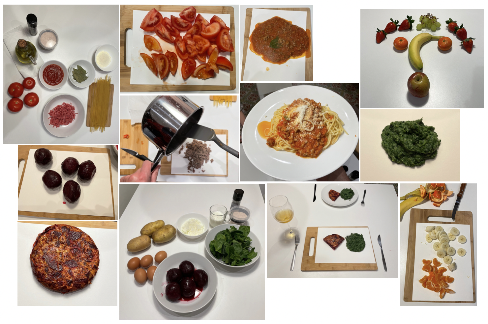

---
hide:
    - toc
---

# Design Studio 2

### My journey so far

More than 4 months have passed since my arrival to Barcelona and starting the MDEF, and many new lessons learned so far.

The **first person perspective** approach has been a new way of discovering the world, making me conscious about a new designer mindset. During my past professional career, I had been designing social projects for others with a traditional human centered approach, so now it is more evident to feel the intervention(s), redefining the concept of empathy and “putting on the other´s shoes”. This has been meaningful not only in the way I start understanding deeply what is happening around me, but also slowly transforming myself into a doer (a maker). Some examples of this were the “Positive foods” (cooking, eating and sharing), “Fabrication for Someone You Love” (designing, fabricating and using the fab lab tools) and “Aprendizaje Emocionante” (drawing, sharing and making conversation). At the same point, when “designing with” I am feeling more confident about my skills and attitudes, and more aware about my weaknesses and aspects to improve. 

So, I will continue doing. Going out of my head and putting the energy in my hands.

My mind has been full of ideas, and I have been always reflecting and over thinking things, which has been over time conflicted in my decision making. Trying **not having preconcibed ideas**, staying in the flow of what is happening right now, listening to others (and trying to talk less) with a humble attitude, and working in different groups (with different backgrounds) it has been a powerful choice. Instead of trying to control what is going to happen, I am open to uncertainty, and new opportunities and never imagined futures are suddenly appearing.  This is important for me and is slowing my way of living and anxiety towards the future.

It is not only about living in the present, but also having the ability of getting from each experience what is meaningful. In this way, the **documentation process** has been an excellent complementary tool for taking my learnings to a next level of understanding and making me aware of what is important. Also, I can prioritize my thoughts and when communicating my work and journey to others, be clearer and feel connected.  This documentation and communication have helped me transforming words and concepts into realities. So, the more I talk about something, the more real is that “something”. In this matter, for having a more solid base I want to focus some energy also on research. 

My personal formula: 70% Act + 20% Reflect + 10% Research.

This master has been the **STARTING POINT OF SOMETHING**.

For me, design is not about a product outcome, but an exercise of interventions in a defined system that is in constantly movement. It is not about the final result, but a circular process (learning loops) where you go gaining feedback.

New project goals for this term:
- Trying new things. You dont't know until you know.
- Keep understanding where I am standing right now.
- Don't forget my own skills and attitudes.
- Connect what is important for me, with what is important for others.
- Design a specific outcome (land my ideas and vision)

### My Interests and What is Happening

My main interests, which I had been driven and exploring, can be sintetize into:  
**emotions**, **fabrication process**, **alternative learning**.

In order to connect this topics I choose **Food** as the medium. I have a special relation with food, more than just nutrition or eating. During all my life, I have experienced many rituals and practices are around food and culture. So I want to dicover what is that "special relation" about.

- What if we could trigger determined emotions through food?
- What if food is eaten acording to what you want or need to feel?
- What if we could fabricate (cook) emotions?
- what if food feels emotions?

The main challenge(s): **Food as a socio-emotional human developer for happiness and an empathic world** I am into explore the relationship of humans and food (non human involvement) and how food behaves and act in this relationality. 

### Design Space (always in beta)

**<https://miro.com/app/board/uXjVOUUri6Q=/?invite_link_id=223047973361)>**

### Intervention #1: The Art of Devouring

My mission:
**Embody a new relationship between (human) emotions and the role of food for the future(s).**

#### Why?
As a basic fact, we need to eat to survive. Over time, food has transformed not only in a basic need, but a way to make conversation, provoking meeting points between people. Many times we take for granted the intimate relationship that is generated between the one who cooks, the one(s) who eat(s) and the food itself. Food can be not only an excuse to gather around, but also a main actor in the relations we need to have as humanbeings.

What if food could express their emotions? Post-human approach shifting the role of food.

#### What?
This intervention turns food into artists, allowing them to express their emotions (in the process of cooking) before being devoured by humans.

#### How?
Choosing different recipes and cooking them using white paper as a base. During the process (in each paper used) the food leaved a mark, which was a unique "piece of art" as a food emotional expression.

After eating each plate, I analyzed each painting asking myself "What is food trying to express?" and named each piece of art, fulfilling myself a role of art critic. 

**The art exhibition: <https://www.behance.net/gallery/136609447/The-art-of-devouring>**

Each painting can be seen as a single vignette (autoethnographic design) because it is a short scene of a story, describing one specific moment in the food fabrication process. 

For exploring the perception of others (and collecting more data) a questionnaire with all the art pieces was shared. People can comment what they think and feel about each painting. 

#### Lessons Learned
- This intervention was situated using autoethnographic design: cooking as a way to express my creativity, reduce anxiety and help mantaining focus. I was aware of my emotions and the "sharing of food" as a way of demonstrating care and love for others. 
- What food "feels" is determined by human perception and traditional communication, so it will always be a subjetive exercise for speculative design. Technology could be an excellent tool for finding new ways of comunication with a non human. We can collaborate with food (no-human approach).
- The process of cooking (maker) and eating (user) is meaningful and intime, there is no boundaries between. Food transforms into a special partner. 
- Senses do not have have a hierarchical order when humans relate with food, they are complementary and needed according to the objetive of the intervention.

#### For the Future(s)

- What makes meaningfull a food experience?
- What makes us humans? What makes them food? What if we change our relationship and concepts about it?
- How food can help to make better relations for human beings?
- Is cooking considered a therapy? Benefits for health? (Culinary Art therapy)
- Food Trends 2022: Serving nostalgia, reduce meat, fusion flavours, superfood.
- How to make a food lab for research?

After this intervention I had the opportunity of talking to some people for feedback and also for searching ways of collaboration. During this process I managed to connect some dots in relation to my past work and my actual interests: what I have being doing in an invisible form is **"giving voice to agents that usually do not have it "**.

My project is about developing mecanisms of communication in the intervention. A new path of exploration emerged, i called it **LEAVING SOME SPACE**.

*why?* **Searching new empathic relationships between humans and things**
*how?* **Interventions that show the potential mechanisms of communication and new narratives for creating alternative realities**
*why?* **Radical exploration and research practice for understanding the present and for imagining future(s)**

*manifesto*
We create realities from stories. A story can be good, bad, crazy, profound, happy, sad, funny, intense, boring, intimate. It can be whatever, depending of whom is telling it. What if we give a voice to agents that usually do not have it?

Let us explore new narratives for communicating what is happening around. 
Let us be truly responsible for generating awareness about critical scenarios.

Let us LEAVE SOME SPACE for creating alternative realities.

**link: <https://cargocollective.com/leavingsomespace/>**

### Intervention #2: The Speech of Things

What if we pay attention to everyday things and try to understand their existence?

For this intervention I imagined that things around can have a different role for society. What if we see them from a spectator view, giving the opportunity to understand their role beyond their traditional being?

#### Speech 1: The bench

On top of a single bench of the park (Parque de la Ciutadella), I placed a small piece of cardboard written: “Do not miss this speech” and a qr-code that linked to the following question: “What do you think the bench wants to tell us?” and people could respond to it. I sat in the grass with my camera focusing the bench. I did the same in other benches of the park.

What happened? Now one pays attention to the bench itself. It is just a utility for sitting in the park. The bench is a tool for humans who want to: rest in the park, have a conversation with someone else, eat something or just sit and stare at the surroundings. Only two young people saw the piece of cardboard and I think they tried to see what was the qr code about, but no responses for the question at all.

After being a couple of hours in the park I felt a bit silly and frustrated because the intervention did not go as I was expecting. I also felt vulnerable and embarrassed about sharing my personal ideas or the “what was supposed to happen”. 

When analyzing this, the radical concept comes to my mind. For me it is about believing in what you think, above all circumstances. Positive attitude, resilience and being brave are characteristics that build my radicality.

Speech of the bench (as a personal reflection):

*“No one cares about me. I am here all day, in the same position and place, waiting for someone to come. Sometimes the sun is drying my body, sometimes the rain makes me wet. Day and night. Waiting. Sooner or later humans sit on top of me, and I feel company. I listen to their stories. Witness a kiss. And just for some seconds, I feel I belong to a place."*

<iframe width="560" height="315" src="https://www.youtube.com/embed/MaD3T9sJf48" title="YouTube video player" frameborder="0" allow="accelerometer; autoplay; clipboard-write; encrypted-media; gyroscope; picture-in-picture" allowfullscreen></iframe>

#### Speech 2: The Chair

In the MDEF classroom I took a black chair and put it on front with the same piece of cardboard that I had used before with the bench. I left it like that for one day. Anonymous people add ideas and collectively this speech was created:

*Dear overweight humans,
Hey there! Sit your tush right on over here. Please lose some weight. Your obesity strains my existence. I don’t care about your medical condition. Just pay me some respect, please.
You people are strange. I've been observing you from time to time, you shift your weight. As a chair, I find this behavior bizarre. Please explain.
I feel so exposed like this. Better to fold me up and put me in the corner.
Help! I am being exploited as a prop in a design intervention! I have not consented to this!
I can potentially change the world. Hahaha.
Thanks, Chair.* 

#### Speech 3: The Sea

Int 2.1: Gravity Talks

Paying attention to how gravity works.

 

