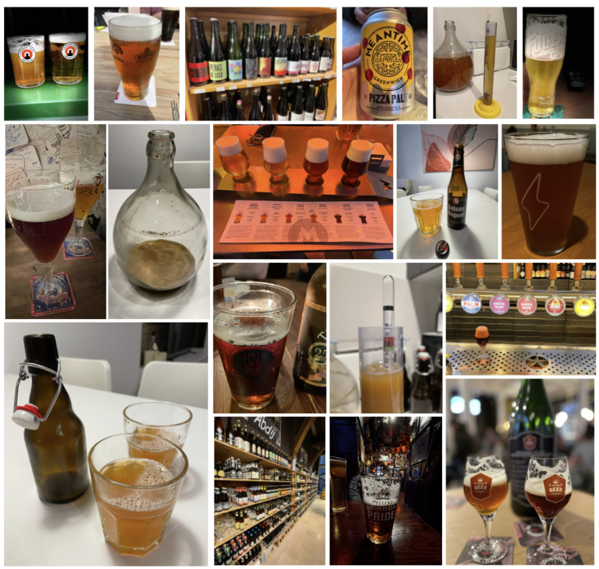
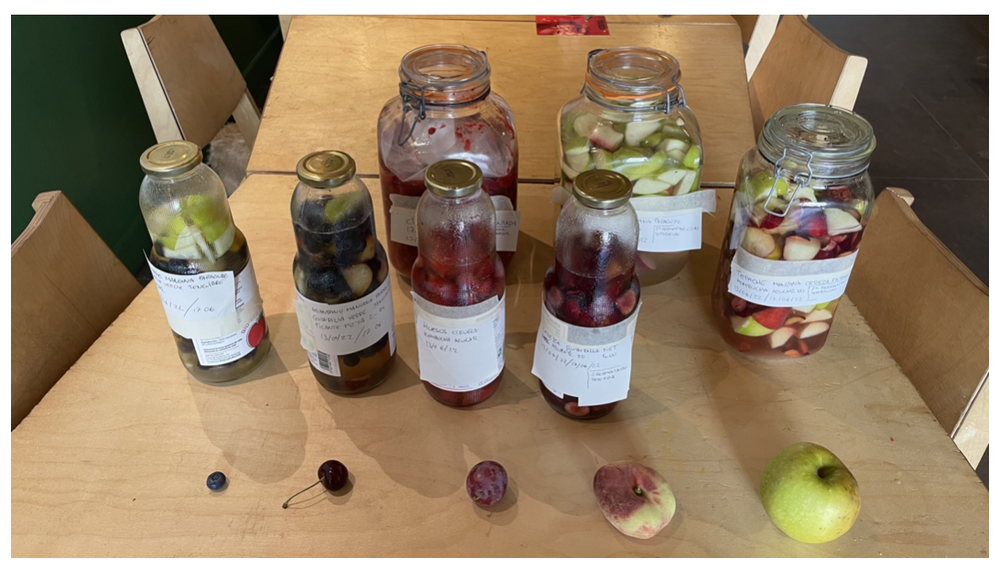
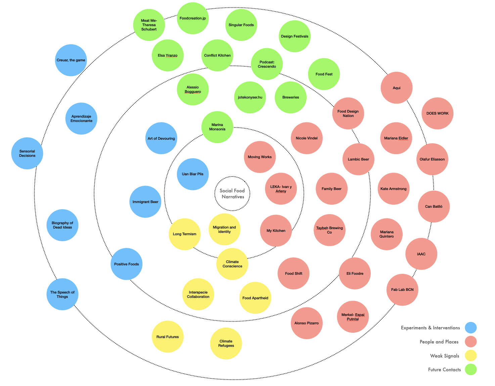

---
hide:
    - toc
---

# Design Studio 3

## Final Interventions

During the last months I have been experimenting with beer crafting. From trying some pre-defined recipes, to learning (by trying and failing) the step-by-step process. The first beers I have produced are full of mistakes in terms of gasification and alcohol level (the fermentation process is a challenge), but in terms of flavor and aroma they are interesting. At the same time, I have been discovering different breweries, bars, and restaurants around Barcelona and on other cities and countries, tasting special craft beers and knowing people in the beer and food industry. From local producers, distributors and restaurant owners, the tasting has transformed in an excuse for exchanging ideas and learning more about this ancient - present beverage.

From here emerges the idea starting to professionalize the casual meetings into interviews, obtaining knowledge not only about the beer itself, but also of the history and meaning for different people, contexts, and cultures.

### UAN BIAR PLIS, stories behind brewing.

This project celebrates diverse contexts, people, and cultures around beer brewing, generating awareness about this ancient and present beverage, and seeking new meanings for the futures.

#### Interviews

A series of interviews to different master brewers, brewery owners and people related to craft beer. Each interview is conducted by video call or in person depending on the location. 

The questions that guide each interview are: 
- Present yourself. (Who are you?)
- Tell the story about this brewery. How and why was born? 
- What does this beer(s) represent? 
- If you could make a beer that represents the world right now, how would it be? 
- What is beer going to mean in the future?

In the last weeks I have contacted more than 20 craft breweries around the world and the interviews are in process.

One specific interview that was special for me was with Canaan Khoury, from Taybeh Bewing Company. This is the only brewery from Palestine. We talked about immigration, challenges of a country that has been in constant war, lifestyle and the future of beer and society. It was meaningful because my ancestors are from Palestine and came to Chile looking for opportunities, so I felt emotional and empathize with the stories behind brewing. 

As the interviews are getting done, I am getting fascinated by the stories, different people, and culture, so the next step is to prepare a mini documentary that can show “the stories behind brewing”.

#### Exhibition (part of MDEF Fest)

What:
Explore different beer cultures and history of beer.

How:
Interviews to different breweries and beer master's around the world. A canvas will be displayed telling the history and example of techniques and styles. Also, there will be a display of bottles made by workshop participants.

#### Workshop (part of MDEF Fest)

What 
Construct our personal identities connecting ingredients and raw materials with emotions, interests, and culture.

How
Each participant will have the opportunity to choose ingredients and raw materials that represent themselves, putting them together into a bottle or “bottling the identity”. These bottles will be displayed in the event.  We will share some experimental beers (with fermented fruits and other), sharing our stories.

1.    Choose the ingredients and fill the bottles (10 min)
2.    Share each story (30 min)
3.    Try experimental beers with ingredients.  
4.    Respond: What will the beer mean in the future? (5 min)

#### Fermentation (collaboration with LEKA)

As part of my project and generation of communities, I have the opportunity to start co-working with Ivan and Arleny from Leka Restaurant. In this case, we are fermenting different fruits and vegetables using alternative techniques. This fermented results are planned to be part of the beer tasting experience, where we are going to mix them with "dead beer" to experiment new flavors and aromas.

#### CON-Serve

For the final part of the master, we grouped our interests and have been working with Angel ChoVikrant Mishra, Ruben de Haan, Georges Hanna, ulia Steketee and Slow Lab,  in this concept:

Our cultures, relationships, tools and rituals are in constant flux. They evolve based on our resources, climates, economies, industries, and rhythm of life. These crafts and customs bring us together and can help us to understand what is to come. We cannot imagine our futures without understanding our past. We invite you to join us as we speculate on how to observe, conserve, and preserve traditions from the past in order to give life to future rituals that allow us to serve-WITH others and safeguard and strengthen relationships. This collective exhibition seeks to generate consciousness about ancient habits that are still in force today, redefine our perceptions of preservation, and contemplate alternative future scenarios around food, crafts, and tools.

The exhibition is part of MDEF-Fest and will be in LEKA.

## Alternative Present

### Interventions and Explorations (Summary)

1.  Positive Foods
The purpose of this experiment was to explore the relationship between food and emotions. The invitation was to bring any food to share that provoked a positive emotion or feeling. Before we shared the food, everyone had to explain what the food was about and what was the provocation they get with it.  

2.  Aprendizaje Emocionante
Exploration about different ways of learning of people in Barcelona, by collecting their individual learning paths. We invited people to draw a map of their learning journey and tell us the story behind key moments. People will draw their personal learning maps and make a reflection about it. 

3.  The Speech of Things
What if we pay attention to everyday things and try to understand their existence?
For this exploration I imagined that things (a chair in the class, a bench in the park, the sea) around can have a different role for society. What if we see them from a spectator view, giving the opportunity to understand their role beyond their traditional being?

4.  Art of Devouring
What if food could express their emotions? Post-human approach shifting the role of food. This intervention turns food into artists, allowing them to express their emotions (in the process of cooking) before being devoured by humans. Choosing different recipes and cooking them using white paper as a base. During the process (in each paper used) the food leaved a mark, which was a unique “piece of art” as a food emotional expression.

5.  “Creuar”, the game
We design a game that empowers kids as agents of change, towards participation on important topics for better futures. Participation is not only a way of responding, but also a way of asking the right questions about what life, relationships, society, nature, tech means. Trying to connect body movement and the freedom of speech as a powerful participation tool, we are enabling a new way of communication between humans.

6.  Immigrant Beer
What if beer could represent an immigrant’s point of view? How to embed immigrant’s feelings, thoughts, and experience into a bottle of beer? Exploring the relationship between immigrants and beer, through a collective brewing experience with different people (migrant designers) and talking about who we are and where we come from.  Each bottle was intervened personally as a form of representation. 

7.  Biography of Dead Ideas
As designers we usually present “the final result”, and the process is hidden or secret (just for us), so revealing the mistakes we make when designing something will open our vulnerabilities and fears (making us more human). Imagine “exposing” and “mixing” the failures in an open exhibition, where each thing is revealed next to another random thing, and together they create a new narrative, a new outcome.

8.  Sensorial Decisions
An ethical tool for generating awareness about how sound affects behavior and human decisions. The conductive surface transforms a touching input into a sound output. It has 9 different sensors (programmed with different frequencies) placed in a creative copper figure for people to experiment drawing guided by sound. The final outcome is the drawing itself.

9.  Uan Bier Plis, stories behind brewing
This project celebrates diverse contexts, people, and cultures around beer brewing, generating awareness about this ancient and present beverage, and seeking new meanings for the futures. Interviews are made to different breweries, master brewers and people related to beer culture around the world. 

10. Con-Serve
This collective exhibition seeks to generate consciousness about ancient habits that are still in force today, redefine our perceptions of preservation, and contemplate alternative future scenarios around food, crafts, and tools.
Exhibition and workshop.

### Connecting the dots

When looking back and analyzing each intervention as part of a whole, some relationships emerge and nothing seems to be happening by chance. From the starting point of discovering what emotions can food generate and the impact of sharing (Positive Foods), to the triggers of learning (Aprendizaje Emocionante) and the understanding of different paths and backgrounds, the first person perspective has make me sensitize and empathize with the people around me, in addition to discovering relevant aspects of myself. The interest of giving voice to beings and things that usually do not have it (The Speech of Things) has open a window of radical exploration about the existence and role of specific things we design and we collaborate with, speculating about the meaning of food (Art of Devouring) for the future. Participation (Creuar, the game) of minorities is crucial to continue seeking alternative realities for the present, and the concept of citizen of the world has scale up (Immigrant beer) because of climate change, digital world and jobs and the constant search of opportunities for a better living. We are in a time we need to stop and look around, because the path is enriched with embedded information (Biography of Dead Ideas) that we have overlooked. It is in this new way of sensing where we discover new relationships between humans and the world (Sensorial decisions), and food appears as a crucial element that humanizes and generates knowledge about each individual mind and soul (Uan bier plis). We are what we eat, and sometimes we need to go back (CON-Serve) to understand what is next to come.

### Social Food Narratives

During the Master in Design for Emergent Futures, my research has focused on seeking new ways of building relationships and ‘giving voice to agents that usually do not have it’, generating awareness about critical scenarios that affect society. My work includes food culture, art, craftsmanship, migration, generating learning and sharing environments as a source of inspiration for new narratives that can impact education and social development.

The alternative present that has emerged is: **SOCIAL FOOD NARRATIVES**

What is it?

Social Food Narratives is a research project that gives a new role to food, exploring the meaning behind it, for understanding culture, regenerating communities, and seeking human relationships with the world. 

-   Exploring food culture for understanding human relationships
-   Creating new ways of bonding with and through food.
-   Redefining the role of food for the future(s)

#### **Design Ethics Report: "We shape our beers and thereafter they shape us"**

For this report I will analyze my master’s project, trying to elaborate an ethical assessment about it. 
Social Food Narratives is a research project that gives a new role to food, exploring the meaning behind it, for understanding cultures, the re-generation communities, seeking human relationships with the world. 

Why is this important? Humans need food to survive, so is a “thing” that is extremely bonded to life and existence. During time, cultures and communities have elaborate different types of food, shifting what we eat, how we eat and why we eat. From the first civilizations (and before that) to the current food design trends, today food is much more than just a nutrition solution. Technologies have played a significant role here, processing ingredients and raw material, accelerating the offer and distribution, democratizing specific recipes, traditions, and rituals. But at the same time, lack of access and social-economical segregation (non-equitative distribution) has generated a food elite system. Right now, people are still dying of hunger in some parts of the world. Right now, the overproduction (and overconsumption) is generating the extinction of natural resources. The relationship we have with food is also a mirror of how we are as society. 

Does this project re-present the person I am? Absolutely, due to my authentic interest in food as a means of social development. Food is more than eating, but a trigger for social understanding. I consider myself a social entity, part of a whole. The person I am today has been nurtured by the set of relationships throughout life. In this sense, I got inspired by Ubuntu theory about caring ethics: ‘umuntu ngumuntu ngabantu’, which translates as “a person is a person through other people”. For me, food has always been much more than nutrition, but rather a tool for social encounters and cultural exploration. I deeply believe that we must investigate new roles in the food system and the meaning for different people, seeking new bonding between beings and promoting extreme consciousness about our environment situation.

The last months I have been exploring with beer crafting and tasting, from understanding all the process of fabrication to sensing different flavors and aromas. This passion has induced to know breweries and to start contacting different producers, not only in Barcelona, but also in many parts of the world, generating conversation and interviews about “what beer means and represent”. During this process, I have been understanding the design process of beer and how the brewer is also a designer, engaging in the practice itself. The main actors in here are brewers and brewery, raw material suppliers and clients, but also all the local environment (neighbors) where the brewery is located. The positive effect of a brewery is mainly connected to social encounter and the generation of community. The negative effect has relation with the abusive consumption, health issues and security. 

As a designer, the main values of this project sense of community, inclusivity, and respect. The beer transforms into the “excuse” for understanding culture, backgrounds, and people. Also, it can be seen almost as a common good, but a conflict occurs when fixing prices and with specific types of beer that are not likable to everyone. 

What does craft beer mean? It is about the technology used? Or the amount of beer produced? Or the process of how it is made? Or the flavor? Part of my research is about revealing traditions, rituals that are attached to beer culture. For this reason, it becomes more important trying to answer the question about: “what is behind a beer”. 

**Social Food Narratives** tries to explore and understand what is behind food and the relationships that can emerge for the futures.

*"Food unfolds ways of seeing the world, but also of identifying our agency in it. We live in an era of digital networks, but by ingesting food we become materially entangled an implicated in a host of relationships. We use food to think through the world, we can never do it entirely as outsiders looking in, and this makes food a close and affective way to work with social and ecological ideas". (Food: Bigger than the place, Catherine Flood and May Roshental Sloan, page 15).*

## Designing Yourself Out

### Scaling Up

During the last term of MDEF, with some classmates we started talking about how to continue our journey together and as time went by, this idea became stronger. So, we set a weekly meeting for discussing our common purpose and sharing our personal dreams,  which emerged into a design collective: **Moving Works Collective**

*What?*

We are a collective of multidisciplinary creatives, thinking and doing “crazy stuff” that generates positive effects for society. (By "crazy stuff"’ we mean: alternative presents we love and what the world needs)

*Why?*

We believe in human beings as a force of good ( social value) starting from local solutions to scalable realities (ecological value), sharing knowledge and with a multidisciplinary scope (joining forces). We have a curious mindset, seeking alternatives beyond our boundaries ( exploration and playfulness), with transparency and open-sourcing for democratizing design (open by default”).

*Who?*

Beings that share a common purpose and values, and we enjoy working with: Joaquin Rosas, Christian Ernst, Roberto Broce and José Hirmas (me).

*How?*

- Honesty: Well-meaning and radically open communication is key. If there are issues, we are not afraid of naming them. Transparency results in accountability; honesty fosters friendships.

- Care: We do this because we love to do it, we care. Build mindfully and with care, take time to be slow. Don’t move fast if there might be things to break or people to hurt.

- Critical Thinking: We never settle for “we’ve always done it like that”. Wherever possible, question the status quo and develop new paradigms.

- Distributed: Think global, act local. We are able to work from everywhere, at any time, with everyone. Global citizens with their feet in the midst of local communities.

- Playfulness: We are kids at heart. Curiosity is the driver of creativity. We believe this is the only way to face uncertainty and rapid change.

*2022 Plan*

For this year we are planning in participating in some design festivals and doing specific exhibitions, and continue developing projects around the topics of technology, education, social development, arts, design and new materials.

## Final Reflection

*Who am I?*

I am José Hirmas Stark, a proud chilean, palestinian-hungarian descendant. My professional background is related to project design, social entrepreneurship, and education. My research focuses on seeking new ways of building relationships and ‘giving voice to agents that usually do not have it’, generating awareness about critical scenarios that affect society. Work in projects that include food culture, art, craftsmanship, migration, generating learning and sharing environments and a source of inspiration for new narratives that can impact education and social development.

*Why MDEF?*

This journey has been "the starting point of something". During life, we usually tend to go forward, developing ourselves in a linear form as a straight race. But sometimes, and more often, we need to stop. This pause helps you look around and understand "where you are" with another scope, analyzing your background and raising awareness of the challenges we have as humanity. On this path, you begin to enter in your deepest mind and soul, discovering hidden forces that construct your own identity, and instead of going forward, you began to bridge the gap between 'who you are' and 'who do you want to be'. 

MDEF is a trigger for understanding your role in reality and shift the path for your alternative present, taking into consideration that we are just a small but important part of a whole.
 

*Whats Next?*

My journey continues feeling part of a group of people that are 'not blind' in this reality. As part of a new collective I am challenged to go on with my research project, making radical experiments and trying to be an agent of change.

The alternative meanings of food and the seeking of what is food for the future, is part of my project and the generation of a community is still going on. In concrete, i will focus in beer culture, planning to set a deadline for a documentary about what is behind beer for different people around the world.  By this I am trying to set emerging relations between art as a form of consciousness and social development as the main purpose.

Just for you to know, right now it feels as a mixture of emotions. My soul is attached to the multicultural group of human beings I have been working, studying, reflecting and dreaming with. I will not take this relationships for granted. Thanks.

