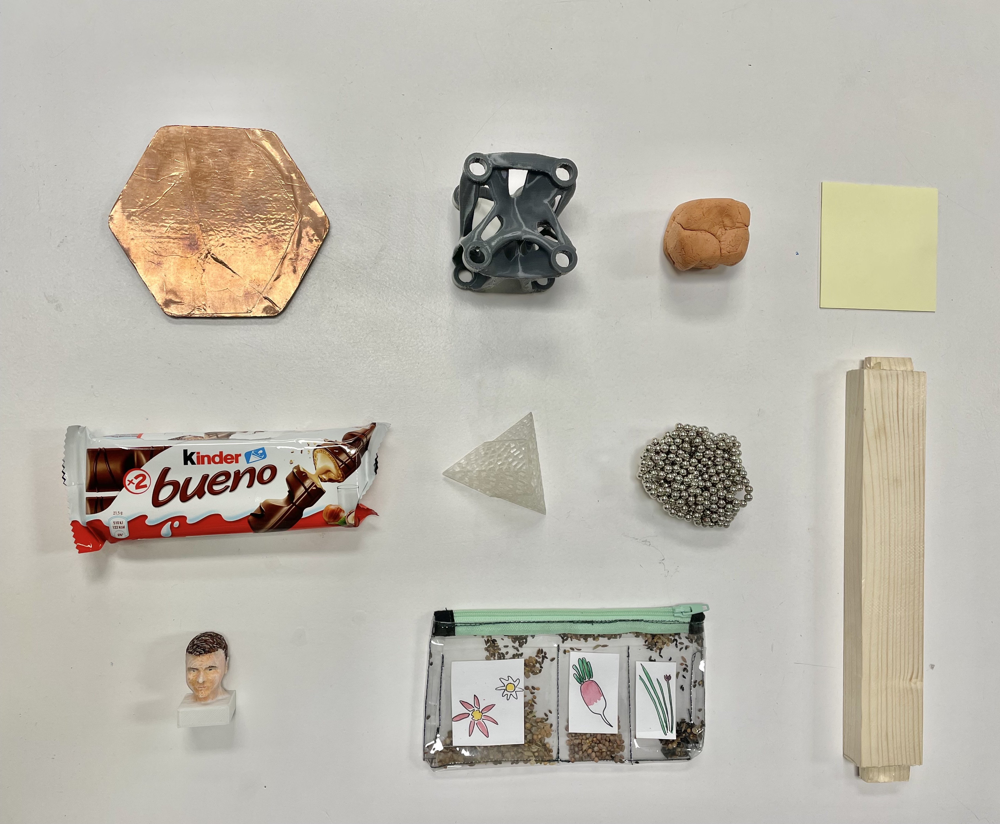
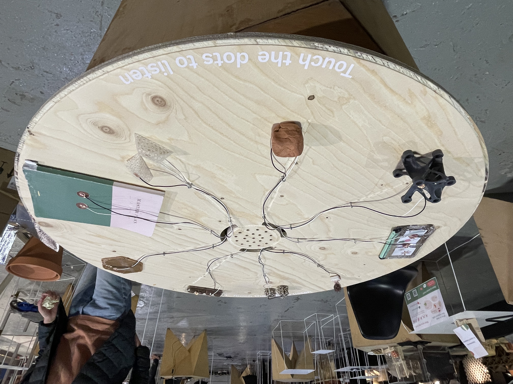
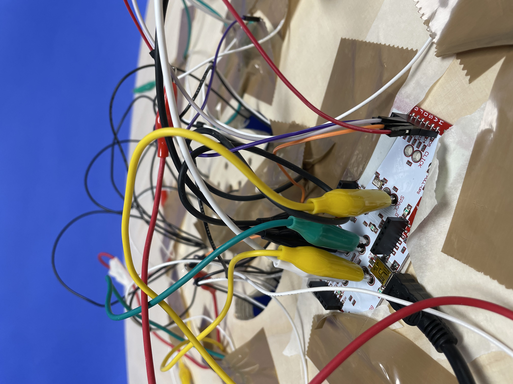
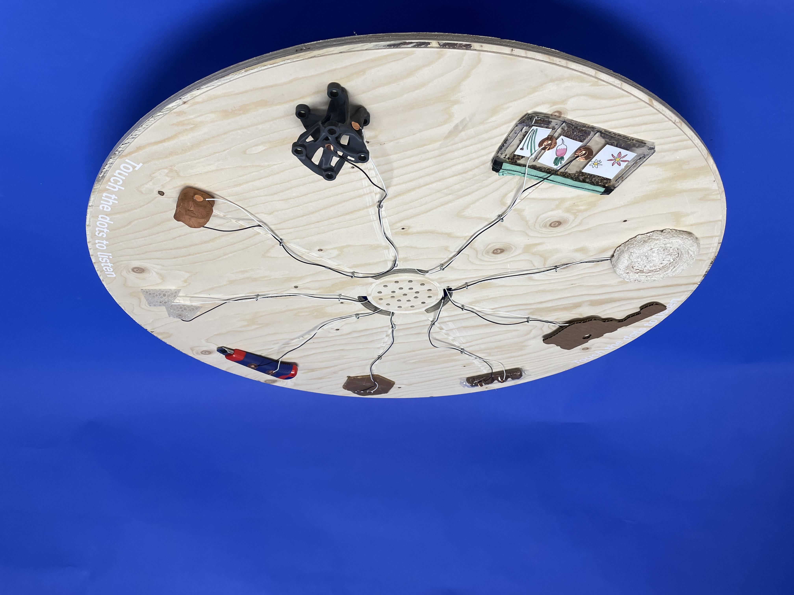
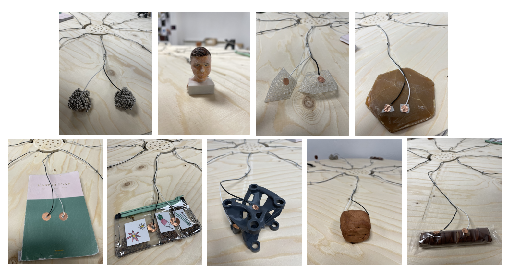

---
hide:
    - toc
---

# Challenge 2

## Develop an artifact “that allows you to explain your project to others” or “interact with others so that they understand your research project.”

For this challenge I worked with Angel and Aparna, sharing our individual interests and getting to intersect the topics of: culture, new narratives and collective biographies. During the first day we discussed about our ideas, getting inpsired with references, making some sketches and defining what we want to show on Design Dialogues 2. 

*What is the aim? (what provocation do we want to show?)*: As designers we usually present “the final result”, and the process is hidden or secret (just for us), so revealing the mistakes we make when designing something will open our vulnerabilities and fears (making us more human). Imagine “exposing” and “mixing” the failures in an open exhibition, where each thing is revealed next to another random thing, and together they create a new narrative, a new outcome. As the biography of things: The death of a failure in relation to another failure can be represented as a new beginning. So, what if the individual failures of designers can have a collective narrative for emergent outcomes?, How is collective vulnerability in design a trigger for new biographies?.

Link to our miro board: <https://miro.com/app/board/uXjVOErRQPQ=/>

### **“Biography of Dead Ideas/Things”** 
**What can emerge from the connections of our collective “dead” ideas?**

In this exhibition, we aim to investigate death, failure, and vulnerability within the design process and how these individual moments can collectively be brought to life to create new and collective emergent narratives.

As designers, we usually present only the final outcomes of our designs to the public, while the process tends to stay hidden in the “black box”. During term2 of our MDEF program, each of us has experienced a range of emotions within our design process. At times we have felt hope and excitement and at times frustration and failure. Within this journey, many ideas and things have been created and many have been laid to death. 

We want to open up the “black box” of our design processes, and gather these moments which we consider failures and mistakes. By collecting the “dead” artifacts, the ones that did not make it alive, from individual processes, we hope to explore the connections between these objects and generate new narratives. Through these new narratives, we aim to open up an alternative understanding of failure within the design process and expose the power of the collective. 

<iframe title="vimeo-player" src="https://player.vimeo.com/video/702921447?h=d5e95c7779" width="640" height="360" frameborder="0" allowfullscreen></iframe>

**In this repository link you can see all the documentation of the process and final results: <https://github.com/aparna2806/FAB-ACADEMY-2>**

### Personal Reflection

Objects have embedded data regarding their existence and use. Through an object, we can explore the environment, the context and generate relationships that allow us to understand a moment, a thought or an action. For this reason, the objects that surround us are projections of our ways of seeing, feeling, acting and living.

Observations:

- To make the interaction more meaningful we choose a "whispering voice" so when touching the object they will tell you a secret. Some people thought it was creepy or sexy. Also, touching many objects at the same time make the artifact be transformed into a sound mixer, so participants play with it. 
- As being coherent with our project, it was interesting to analyze what was beneath the surface of the artifact (opening the black box), so you can see a bunch of cables, the connections, the computer and the electronic kit (makey makey stem kit) we used. The difference of the clean surface and the chaotic bottom shows that what we see is not always what it really is. 
- This artifact can be used to understand communities: a house or family, a group of friends, a specific culture, etc. Imagine that you could get objects that are meaningful for individuals and put them together to see new relationships of that specific community. 
- When collecting the objects, to hear my classmates personal stories was also a way to empathize with them and understand what is beneath "their surface": feelings, emotions and thoughts.

