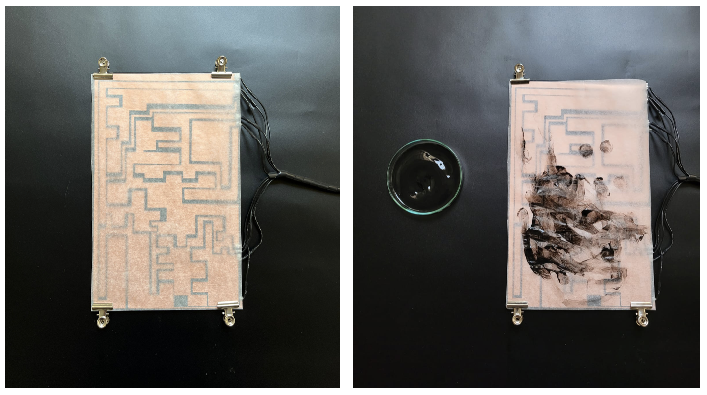
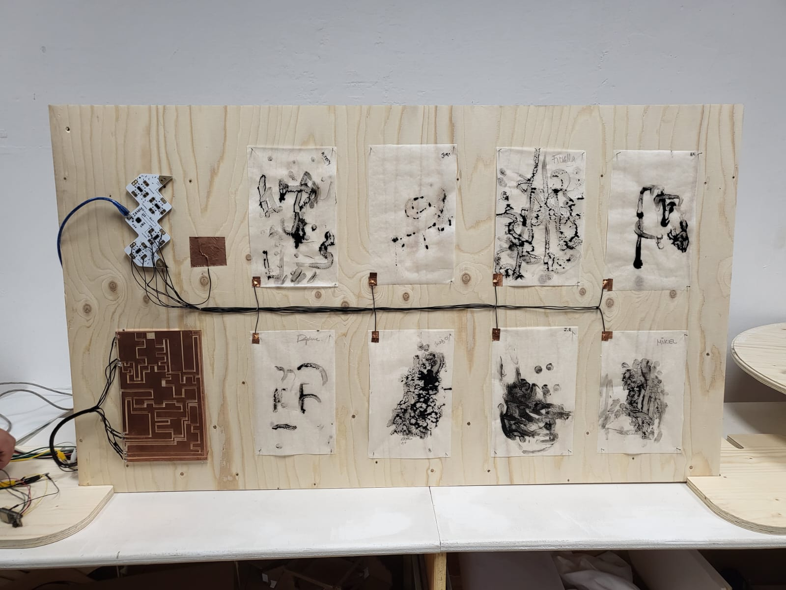

---
hide:
    - toc
---

# Challenge 3

## Design and make an “ethical tool or artifact” that allows you interact with others

For this challenge I worked with Joaquín, Kai, Tatiana, and we explored **how sound affects humans decisions.**

Based on design ethics, we started discussing about the non-neutrality of design, boundaries between technology and design, how design choices influence the functionality of society and the re-creation of reality.

Our common areas of interest are music, games, communication, interactive design and low tech with the purpose of seeking new ways of relationship between humans and non-humans. 

Link to our miro board: <https://miro.com/app/board/uXjVO4T-S2o=/>

### **“Sensorial Decisions”**

An ethical tool for generating awareness about how sound affects behaviour and human decisions.

The conductive surface transforms a touching input into a sound output. It has 9 different sensors (programmed with different frecuencies) placed in a creative copper figure for people to experiment drawing guided by sound. The final outcome is the drawing itself.

<iframe title="vimeo-player" src="https://player.vimeo.com/video/706955265?h=68fb8f0685" width="640" height="360" frameborder="0" allowfullscreen></iframe>

**In this repository link you can see all the documentation of the process and final results: <https://github.com/jose-hirmas/fab_challenge_3/blob/main/README.md>**

### Personal Reflection

Humans are not rational. The decisions we make are influenced by how we sense the world, were perception plays a significant role. What if we pay specific attention to sound and how this influences our decisions? 

This challenge make me reflect about the importance of hearing as a tool for understanding the world and also about how different frecuencies of sound can be attractive to some people and not worth for others.

During the electronics tasks, I found very intuitive and accesible the programming language, allowing myself (a complete amateur in programming) to be able to generate (or adequate) the code for the correct input-output use.

As a team we achieved in mixing our personal interests and skills for the development of the challenge, that resulted in a meaningful intervention and outcome. 

