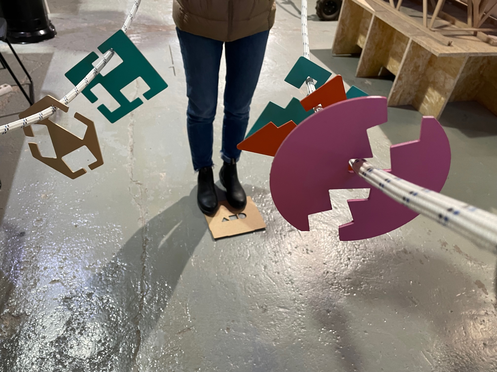
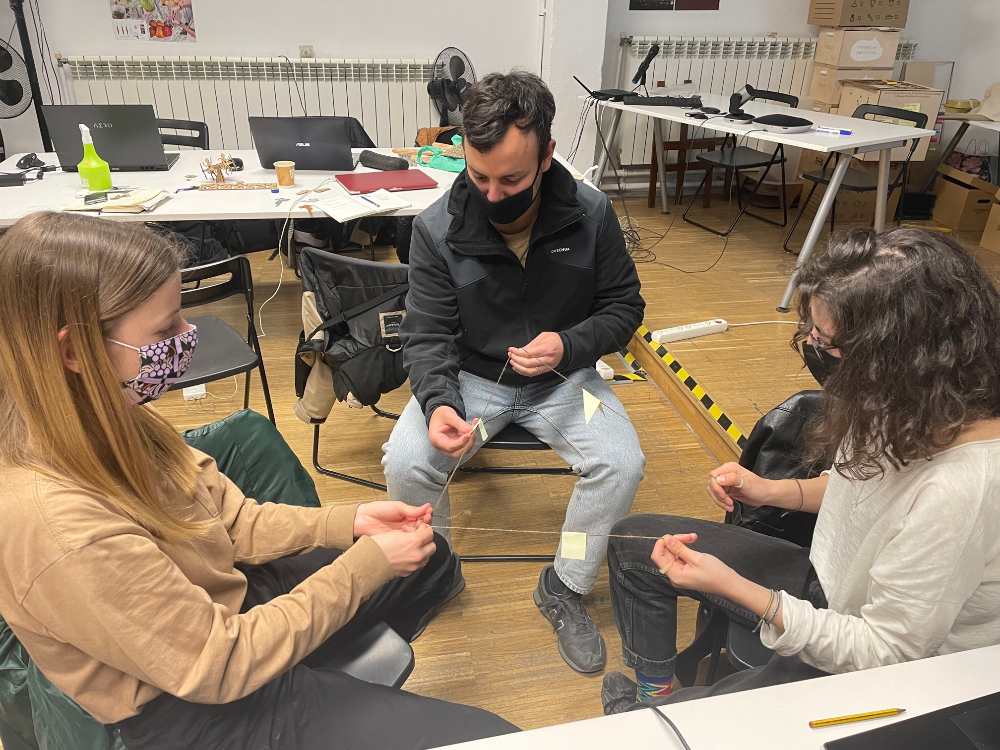
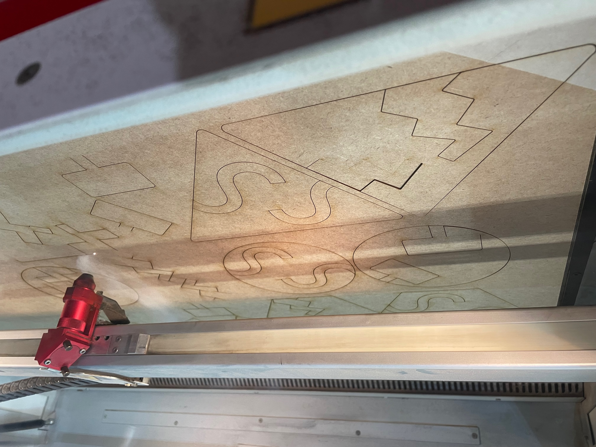
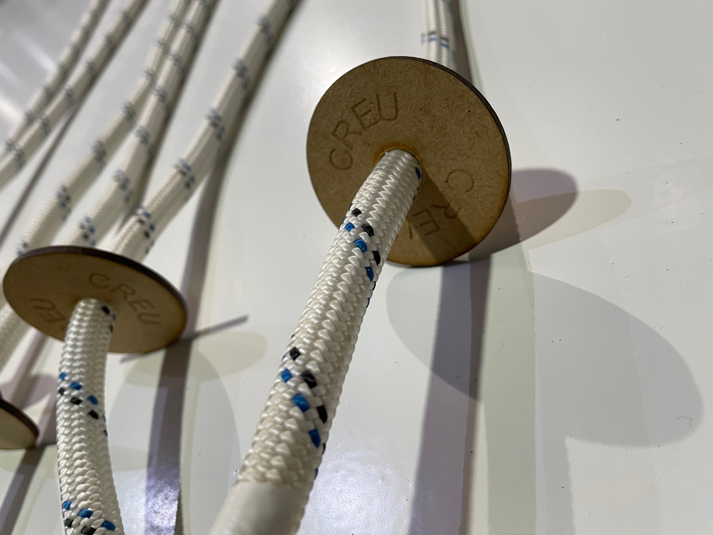

---
hide:
    - toc
---

# Challenges

## Challenge #1: Design and make “something” that can help the process of designing/creating/thinking/collaborating with others

For this challenge I worked with Borka and Anna, sharing our personal interests and defining the group topic as: **Participatory games for shared realities**.

The question we held was the trigger for developing the challenge: **How we encourage participation in kids?** and that is how **"CREUAR"** emerged. 

### Why "CREUAR"?

Democratizing participation is a big challenge when imagining and co-creating the future(s). The decisions that we make as society are commonly led by the same people, generating a misunderstanding of issues and a lack of holistic wellbeing.

We design a game that empowers kids as agents of change, towards participation on important topics for better futures. Participation is not only a way of responding, but also a way of asking the right questions about what life, relationships, society, nature, tech means. Trying to connect body movement and the freedom of speech as a powerful participation tool, we are enabling a new way of communication between humans.

**In this repository link you can see all the documentation of the process and final results: <https://github.com/Anna-Mestres/fab_challenge_I>**

### Personal Reflection

During this term I am exploring "how to give voice to agents that do not have" and over time kids have been underrated in participating in decisions. This challenge was a good speculative design exercise for imagining a world where kids have a responsibility, validation among adults and shifting their role in society (empowered by the decisions we need to make as humanity). 

As a team we managed to define our roles which led to a clarity in tasks, responsibility towards the process and collaborating with each other consistently. My main role was about co-developing the purpose of the game and the fabrication process, so my main working space was in the fablab with machines. It was the first time I used the laser cutting machine and I learned the parameters and process of doing a work with it.

Observations:

- The final prototype did not cut well with the laser cutting machine because of lens was dirty (or/and parameters where mistaken) and we did not had the opportuniy to use the machine again, so I had to cut and polish the pieces of the game by hand with let to a lot of time wasting.

- We used a lot of time planning and developing the theoretical design of the game, leaving little time for laser cutting and almost no time for trying the game. For the next time we need to validate in real life the design prototypes. 

- Mixing materials for the prototypes gave us powerfull insights for defining the next steps. We started with post-it and strings (prototype 1), then used cardboard (prototype 2), and finally we used MDF, spray paint and ropes (protoype 3). Pantomimic was also a good tool for imagining the game and defining the relationship betweeen players.

- For scalability we thought of using cardboard and adjusting the parameters to cut enough to fit on the cardboard, by this we give each group the cardboard sheet and ropes needed. Each group can first customize their own game by painting the pieces and then take the pieces out themselves.

- I need to keep on using CAD softwares for improving my skills drawing objects.

