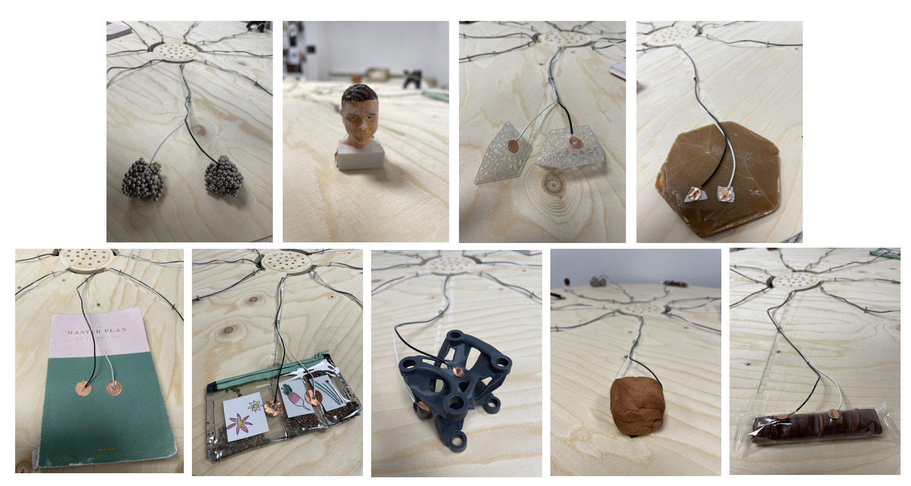

---
hide:
    - toc
---

# Challenges

## Challenge #1: Design and make “something” that can help the process of designing/creating/thinking/collaborating with others

For this challenge I worked with Borka and Anna, sharing our personal interests and defining the group topic as: **Participatory games for shared realities**.

The question we held was the trigger for developing the challenge: **How we encourage participation in kids?** and that is how **"CREUAR"** emerged. 

### Why "CREUAR"?

Democratizing participation is a big challenge when imagining and co-creating the future(s). The decisions that we make as society are commonly led by the same people, generating a misunderstanding of issues and a lack of holistic wellbeing.

We design a game that empowers kids as agents of change, towards participation on important topics for better futures. Participation is not only a way of responding, but also a way of asking the right questions about what life, relationships, society, nature, tech means. Trying to connect body movement and the freedom of speech as a powerful participation tool, we are enabling a new way of communication between humans.

**In this repository link you can see all the documentation of the process and final results: <https://github.com/Anna-Mestres/fab_challenge_I>**

### Personal Reflection

During this term I am exploring "how to give voice to agents that do not have" and over time kids have been underrated in participating in decisions. This challenge was a good speculative design exercise for imagining a world where kids have a responsibility, validation among adults and shifting their role in society (empowered by the decisions we need to make as humanity). 

As a team we managed to define our roles which led to a clarity in tasks, responsibility towards the process and collaborating with each other consistently. My main role was about co-developing the purpose of the game and the fabrication process, so my main working space was in the fablab with machines. It was the first time I used the laser cutting machine and I learned the parameters and process of doing a work with it.

Observations:

- The final prototype did not cut well with the laser cutting machine because of lens was dirty (or/and parameters where mistaken) and we did not had the opportuniy to use the machine again, so I had to cut and polish the pieces of the game by hand with let to a lot of time wasting.

- We used a lot of time planning and developing the theoretical design of the game, leaving little time for laser cutting and almost no time for trying the game. For the next time we need to validate in real life the design prototypes. 

- Mixing materials for the prototypes gave us powerfull insights for defining the next steps. We started with post-it and strings (prototype 1), then used cardboard (prototype 2), and finally we used MDF, spray paint and ropes (protoype 3). Pantomimic was also a good tool for imagining the game and defining the relationship betweeen players.

- For scalability we thought of using cardboard and adjusting the parameters to cut enough to fit on the cardboard, by this we give each group the cardboard sheet and ropes needed. Each group can first customize their own game by painting the pieces and then take the pieces out themselves.

- I need to keep on using CAD softwares for improving my skills drawing objects.

## Challenge #2: Develop an artifact “that allows you to explain your project to others” or “interact with others so that they understand your research project.”

For this challenge I worked with Angel and Aparna, sharing our individual interests and getting to intersect the topics of: culture, new narratives and collective biographies. During the first day we discussed about our ideas, getting inpsired with references, making some sketches and defining what we want to show on Design Dialogues 2. 

*What is the aim? (what provocation do we want to show?)*: As designers we usually present “the final result”, and the process is hidden or secret (just for us), so revealing the mistakes we make when designing something will open our vulnerabilities and fears (making us more human). Imagine “exposing” and “mixing” the failures in an open exhibition, where each thing is revealed next to another random thing, and together they create a new narrative, a new outcome. As the biography of things: The death of a failure in relation to another failure can be represented as a new beginning. So, what if the individual failures of designers can have a collective narrative for emergent outcomes?, How is collective vulnerability in design a trigger for new biographies?.

Link to our miro board: <https://miro.com/app/board/uXjVOErRQPQ=/>

### **“Biography of Dead Ideas/Things”** 
**What can emerge from the connections of our collective “dead” ideas?**

In this exhibition, we aim to investigate death, failure, and vulnerability within the design process and how these individual moments can collectively be brought to life to create new and collective emergent narratives.

As designers, we usually present only the final outcomes of our designs to the public, while the process tends to stay hidden in the “black box”. During term2 of our MDEF program, each of us has experienced a range of emotions within our design process. At times we have felt hope and excitement and at times frustration and failure. Within this journey, many ideas and things have been created and many have been laid to death. 

We want to open up the “black box” of our design processes, and gather these moments which we consider failures and mistakes. By collecting the “dead” artifacts, the ones that did not make it alive, from individual processes, we hope to explore the connections between these objects and generate new narratives. Through these new narratives, we aim to open up an alternative understanding of failure within the design process and expose the power of the collective. 

**In this repository link you can see all the documentation of the process and final results: <https://github.com/aparna2806/FAB-ACADEMY-2>**

### Personal Reflection

Objects have embedded data regarding their existence and use. Through an object, we can explore the environment, the context and generate relationships that allow us to understand a moment, a thought or an action. For this reason, the objects that surround us are projections of our ways of seeing, feeling, acting and living.

Observations:

- To make the interaction more meaningful we choose a "whispering voice" so when touching the object they will tell you a secret. Some people thought it was creepy or sexy. Also, touching many objects at the same time make the artifact be transformed into a sound mixer, so participants play with it. 
- As being coherent with our project, it was interesting to analyze what was beneath the surface of the artifact (opening the black box), so you can see a bunch of cables, the connections, the computer and the electronic kit (makey makey stem kit) we used. The difference of the clean surface and the chaotic bottom shows that what we see is not always what it really is. 
- This artifact can be used to understand communities: a house or family, a group of friends, a specific culture, etc. Imagine that you could get objects that are meaningful for individuals and put them together to see new relationships of that specific community. 
- When collecting the objects, to hear my classmates personal stories was also a way to empathize with them and understand what is beneath "their surface": feelings, emotions and thoughts.

