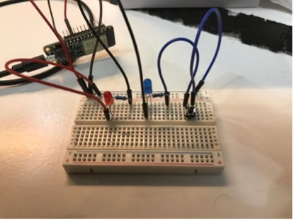
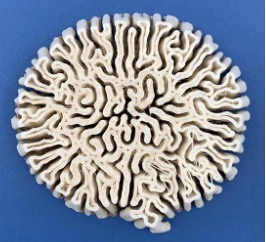
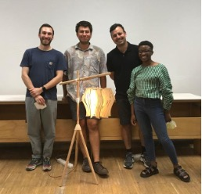
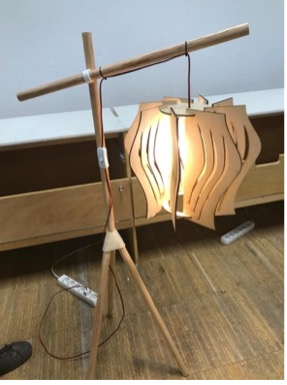
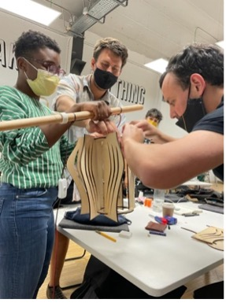
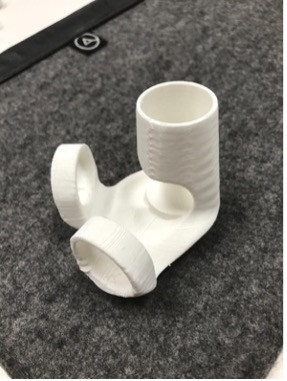

---
hide:
    - toc
---

# Precourses

> ## “Todo lo que puede ser imaginado es real”

The pre courses where a nice “excuse” to know my future classmates, with their different backgrounds. Also, a good start for exploring IAAC´s fab lab and the Poblenou’s neighborhood. I liked the fact of being part of a multicultural and international master, where all the conversations start from empathy and trying to discover the other skills, knowledge and attitudes towards life. 

During our pre courses there was a lot of new information about technology, electronics design, softwares and the use of machines which I have never been up to, which puts me in a challenge to learn these techniques.

**The Led Circuit (Inputs and Outputs)** 
With the electronics kit, we had to develop a led project which consisted in a game where you had to chose some letters and the light turned on green or red depending if you where right or wrong. }

   
**Mama is Here (Communicating Design Ideas)**
 Design a poster for a random idea. My idea was an app that cooked your own local recipes. This app was for immigrants that wanted to remember a special home dish. 

     
**Agoraphobia (Communicating Design Ideas)**
Design a reel for a random object, spirit and segment. The spirit was “agoraphobia”, the segment was “researchers” and the object that we choose was this one:

Here is a link with the final reel **<https://www.youtube.com/watch?v=YOFtGCziHsY>**

**The Imperfect Lamp (Fab Lab)**
design and fabricate a lamp using 3d printers, digital design softwares and laser cutting machines. 

 
 
 

#### The Best: 
Discovering the fab lab machines and our capacity to create almost anything.

#### The Lessons Learned:
-   It is better to make a small project and finished it, than rather being too ambitious and just do a part of it. The time is limited for the design projects.
-   Each classmate has his skills and knowledge which is great when working in multidisciplinary teams.
-   Learning by doing will be one of my central pillars for this master.

#### The Challenges:
-   Arduino, electronics and coding.
-   Illustrator and Photoshop software 
-   Rhino and Fusion 360 digital design softwares
-   Printing in a 3D printer and using laser cutting machine

