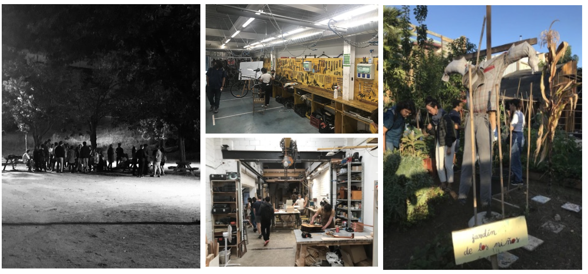
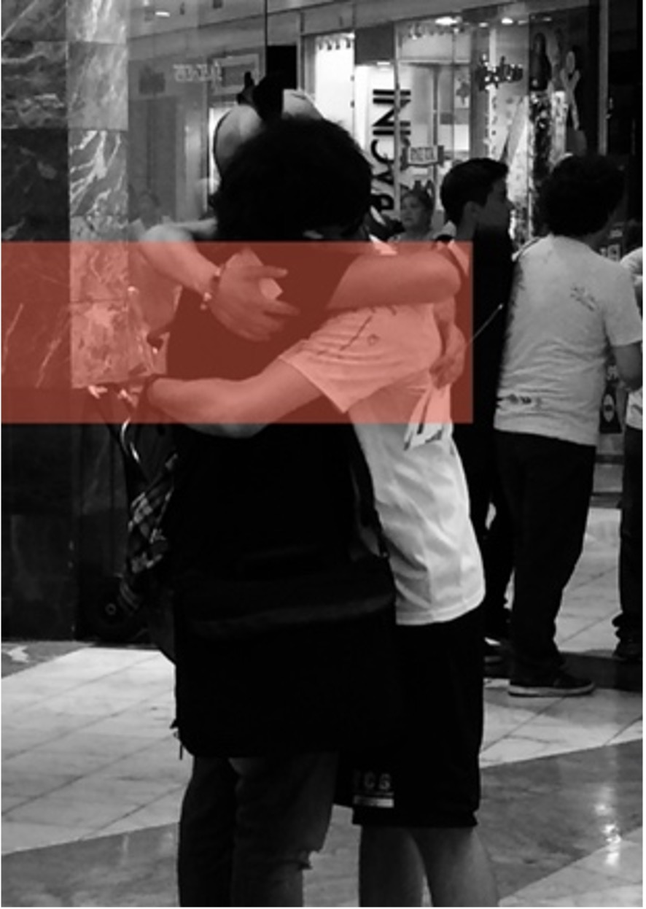

---
hide:
    - toc
---

# Bootcamp

> ## “Me gusta la gente sentí pensante, que no separa la razón del corazón”

This first week was a good start to guide and focus on the expectations of the MDEF, understanding the “why” and purpose of this experience. During this week I have been thinking a lot in my own interests and my past working experience, trying to plan a future road for my professional career.

In my walks around I have been wondering the multicultural city of Barcelona and how all the people enjoy open public spaces. The life happens in parks, public spaces and in the street, where the sense of community is palpable. 

    
    
**What´s My Fight**

Human relationships and the learning that is generated when we share moves me. In general I am a social person, who vibrates with the human encounter. Throughout my life I have been a privileged person in social and educational terms, which has made me discover the lack of learning opportunities that exist in some sectors of my city, my country and the world. I have worked in vulnerable contexts to support children and young people, empower them and create bonds so that they can develop their full potential. 
My fight is about THE POWER OF HUMAN RELATIONS and how this affects the learning process of people. 

#### The Best: 
All the resources (inhouse and the neighborhood) we have to develop our project. 

#### The Lessons Learned:
-   Be with an introspective attitude towards the development of my project. “It’s about me”.
-   The sense community is vital for the development of a social project. 
-   We must go out and meet the people.
-   First Person Perspective as a design process.

#### The Challenges:
-   Documentation of my master process
-   Use git for my webpage 

