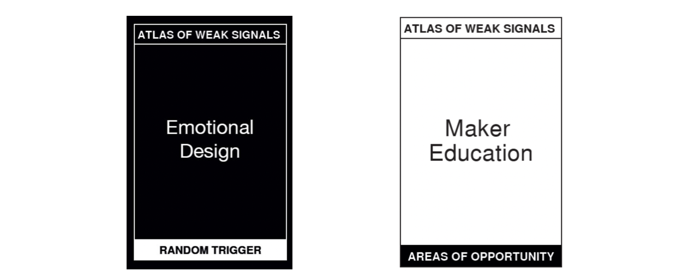
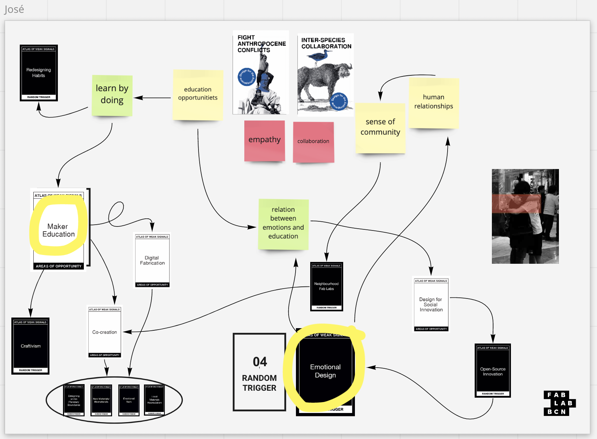
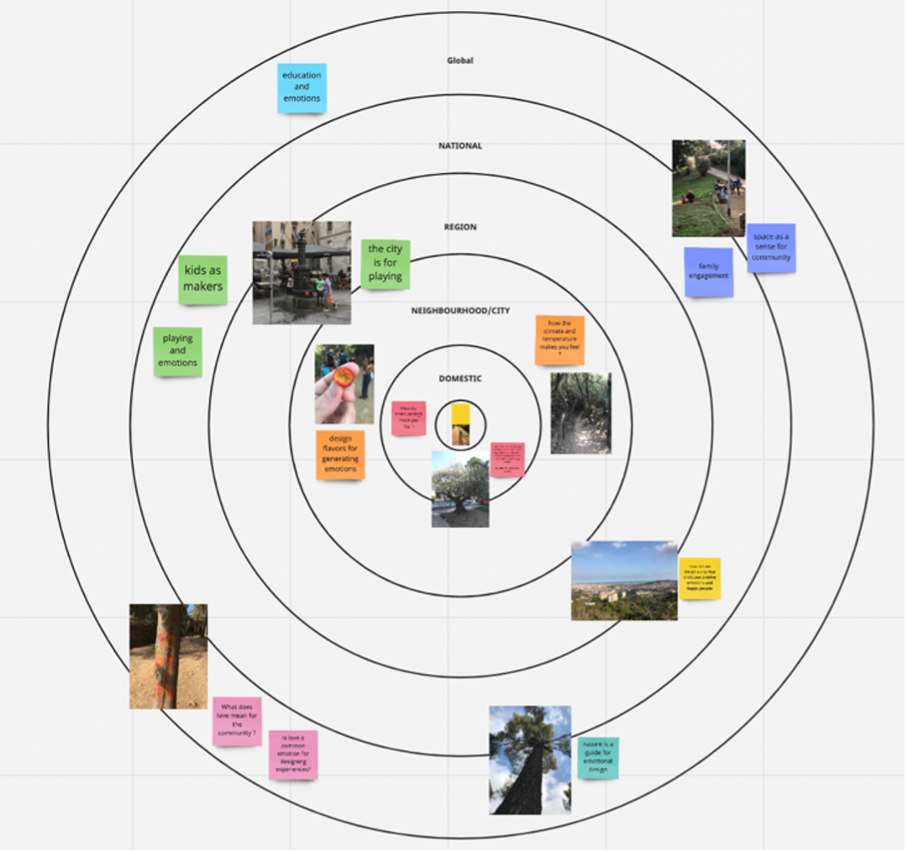
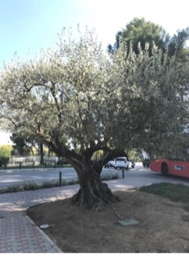
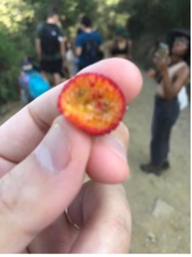
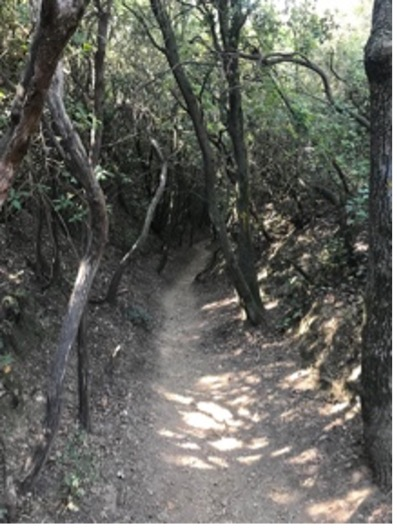
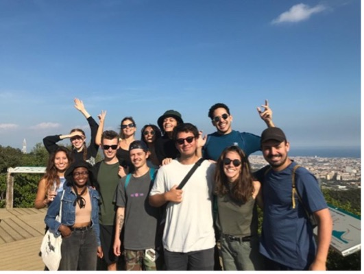
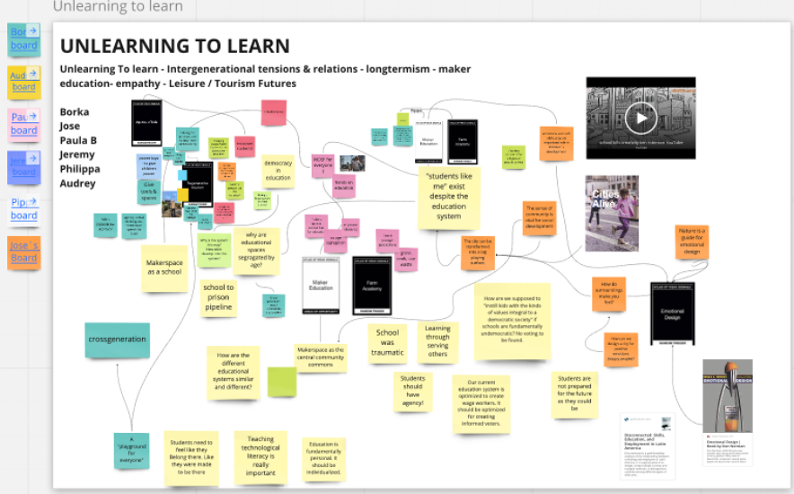

---
hide:
    - toc
---

# Atlas of Weak Signals

## Term 1

> ## "Lo esencial es invisibles a los ojos" (Antoine de Saint-Exupéry)

The weak signals I chose are “Emotional Design” and “Maker Education”, this is because I have interests in the relationship and interactions between human beings and how emotions play a role in the social educational development. For me, traditional education is obsolete in latam and the world. I have been making classes in public rural schools back in Chile, where I have evidence the importance of bonding between students and teacher-student, for their integral formation. Also interested in how learning by doing and gamification can be an excellent tool for children´s integration. 

**Weak Signals: Emotional Design and Maker Education**

I believe that emotions are present in every interaction between humans and their environment. Also that the main issues we are facing are because we need to deeply understand what we are feeling and what others also feel. I am really interested in exploring how human emotions can be sustained as a main “city developer”. We don´t talk about feelings because we get embarrassed, but we always feel things. The challenge is how we get conscious about our own feelings and emotions, and how we can manage to know new people´s emotions to understand how body, brain and soul are connected. 

The learning process is not about theorical and technical skills, but how we can use in the real world all the tools we develop. I like the doing as the best and more effective way to really explore, discover and learn. Since school I have been not a traditional student, I coud not sit in a chair and just listen teachers, always being hyperkinetic and having attention deficit (ADHD) was really a challenge when going to a traditional school and education. Also during my life I have managed to realize that the best way of learning for me was by doing things on my own. The concept of maker is attached to the capacity of creation that we humans are able to. Understanding humans as makers is also seeing us creators, discoverers, imagining new Futures and trying the best ways. Also, to accept that we are not perfect in anyway and that making mistake is not a bad thing, but a way to discover yourself, gain knowledge, and explore the world.

**Relationship between two weak signals**

During this week I have been exploring myself emotions since I wake up until I go to sleep in the night, being aware of every design experience I had the opportunity to be in. 

**Multiscalar Diagram: The Hike of Emotions**

During this week I have been exploring myself emotions since I wake up until I go to sleep in the night, being aware of every design experience I had the opportunity to be in. 

We went on a hiking experience for developing the multiscalar diagram On this adventure I decided to pay attention to my emotions during all day.

1.  When getting to the Metro station on time: anxiety and a bit of stress because i as a bit late

2.  We started de hike joining all together next to a olive tree which is a safe place for me because this is the tree that represents my family. My emotions: safety and comfort.

3.  In the walk we had the opportunity to try some native fruit I don’t remember the name but this brought me to my childhood because we had a lot of fruit trees and go around eating them. This provoke me joy and nostalgia. 

4.  In one part of the hike we had to get in silence and the atmosphere changed. We enter “the forest” in a really quite mood. There I felt peace and freedom emotions. Also the climate change and it was colder. ¿How do climate changes make you feel?

5.  We get to the top and had an amazing view of almost all Barcelona. For the first time I had a sense of dimensions of the city, seeing everything from a different perspective (“looking from the balcony”). I felt small and humble and, in a way, big enough for trying to solve some cities issues. My emotions were dragged to motivation and empowerment. 

6.  All the way to the top and going down we were also in a happy and exploring mood. My classmates have a nice attitude, so we can talk and go knowing each other more. For me, it is important the relations that we have early constructed with the group, each one with their own backgrounds, cultures, thoughts, and ways of seeing life. We are in a journey together but living it at our own pace. 

Some questions and notes I have in different scales:

-   How do surroundings make you feel?
-   Design flavors for generating emotions
-   How can we design a city for positive emotions (happy people)?
-   Nature is a guide for emotional design
-   The city can be transformed into a big playing surface.
-   The sense of community is vital for social development
-   We need to bond education and emotions.

**Collaborative diagram**

For the collaborative diagram I was amazed with the education issues and thoughts that some of my classmates have, that are really attached to my own beliefs. This make me think that I all not alone on this quest.  I liked the concept of “cross generation” and “a playground for everyone”.

*I will like to contact:*
-   Go to explore some schools and alternative learning methods in Barcelona
-   Neuroeducation specialist for understanding how emotions and education are bond.
-   Participate in maker experience

*Experiment I will like to make:*
-   Design a workshop for understanding kids emotions when going on an learning experience. 

*A new skill for my personal development plan:*
-   learning to fail and trying to focus.
-   Unlearning to learn.

#### The best: 
the amazing view from the top of the mountain.

#### The Lessons Learned:
- There are many futures.
- Our classmates are usefull resources. 
- Colaboration is relevant for the development of my project.
- Technology is constructed in a context. 

#### The challenges:
- Change my mindset to exploration and observation in every day.
- Visit new places to get inspired.

## Term 2

This seminar was about talking, discussing and reflecting about "the elephant in the room", specifically of how we are developing (or undeveloping) as humanbeings and the relations that we have with nature. 

The first class was a roadmap of the world divided into 4 stages: awareness with what is happening (telling the truth), how everything changes (mutation), what is the plan for the future, and actions that are helping to balance and solve social and ecological issues. I got inspired by some art exhibitions and examples that try to generate awareness about critical scenarios: Olafur Elliason's ice watch, the concept of hyperobject, the mutation of chicken, plastiglomerates, Donna Haraway's becoming with.

The second class was about introducing the concept of surveillance capitalism, and how human phsycology is directly attached to the use of internet and world wide web ("we are working but we are not aware of that"). We discussed about fake news, attention economy and engagement, extreme personalization, data extractivism, and that we are beggining this new age of web3: crypto, blockchain and DAO (distributed autonomy organization). 

The third class was about defining what is a job, what it means to work in an era of automatization and AI. Reflecting on what will people do with robots replacing us in traditional jobs. We are facing an uncertain job security for the future that may paralize us or be the trigger to change the perspective and way of living ("yay a robot took over my job, now I can enjoy life"). A new concept arises here: the caring economy.

The fourth class was about "after the nation-state", defining the difference between "nation" (culture and people) and "state" (politics). We had to respond: Where are we from? so it was very interesting to reflect about my own life because I feel chilean but not latin and have palestinian, hungarian and spanish roots. After seeing the video of the class, new concepts appear such as: rural-urban division, anti immigration movements and refugees. Also the question that arises is: Is there an alternative of a political-social organization that is not a nation-state? Weak signals: global movements, tech that bypasses state control, new infraestructural wars, relocating nations because of climate crisis, new colonialisms. The wish-list: global finance regulation, global flexible democracy and a new shape of citizenship. 

### Reflection

I have lived all my life in Santiago de Chile, a city that for the last 30 years has been very stable in terms of political, social and economic growth, and feel very privileged to have had a good quality of life, which in some way is luck. Since my early professional career I had tried to move from my state of comfort, having the opportunity to know and feel the other side of Chile, understanding the main problems that we are facing as a nation-state. Also feeling very responsible and with the power to help and make changes. Silently the problems began to grow, and we hide them with this "false hapinness economic growth". The last 3 years all this "false happiness" and the people's feelings began to be visible, uncovering the pot of a social crisis that affects everyone. This local movement has make us aware and unstable basic principles of the way we live. Moreover the pandemic has added changes of paradigms and lifestyles.

The first step is "opening your eyes" and see beyond what you have always seen. Going out of Chile, and living in Barcelona, that is a multicultural city, has make me aware of some critical issues that we are facing as humanity. I feel sensibility for immigrants and refugees, in a way because is part of my personal family story, but also because for the first time I am living with the immigrant perception.

In relation to technology, as a young student I had access to internet and social media, but never was too enthusiastic about it so i have always preferred direct relationships and traditional ways of communicating. Maybe this is because emotions and energy are important and feels as a necesity to be in direct contact with other humans. In this matter, during the last years, to work from my computer has been a challenge and when spending too much time in front of the screen I feel the necessity to reconect with the "real world". I am not afraid of automatization because I think humans can not be replaced 100%.

Where do I come from? I feel very chilean and this means that I am part of a country that was built and has grow with the immigrants coming over the years. I love the landscapes of Chile, the food and the people that I am sorrounded. The mix of cultures has been present in my life, in my case palestinian ancestry mixed with hungarian and spanish roots. When I see now new refugees (mainly from central america) coming to my country in search for opportunities I feel empathy. 

Another idea is that for me Chile is not part of Latin America. We are so different to other countries that are in the same continent, and sometimes I feel we are alone, isolated and not wanting to be part of the south american culture. I believe that a community gets richer when you have different backgrounds trying to decide about how we live, what we need and what we want. Why do walls between countries still exist? I think there is fear and feeling vulnerable, lack of communication marked with prejudices and fake news. From each state there is a sense of competition based on the capitalist model, that has polarized the society, individualizing benefits and misunderstanding that we are all part of the same world.

Let us not take the sense of community for granted. We need to talk more to others. We need to listen more to others. And convince ourselves that we are all interconnected.

