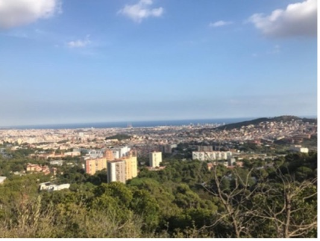

---
hide:
    - toc
---

# Atlas of Weak Signals

> ## "Lo esencial es invisibles a los ojos" (Antoine de Saint-Exupéry)

The weak signals I chose are “Emotional Design” and “Maker Education”, this is because I have interests in the relationship and interactions between human beings and how emotions play a role in the social educational development. For me, traditional education is obsolete in latam and the world. I have been making classes in public rural schools back in Chile, where I have evidence the importance of bonding between students and teacher-student, for their integral formation. Also interested in how learning by doing and gamification can be an excellent tool for children´s integration. 

**Weak Signals: Emotional Design and Maker Education**

I believe that emotions are present in every interaction between humans and their environment. Also that the main issues we are facing are because we need to deeply understand what we are feeling and what others also feel. I am really interested in exploring how human emotions can be sustained as a main “city developer”. We don´t talk about feelings because we get embarrassed, but we always feel things. The challenge is how we get conscious about our own feelings and emotions, and how we can manage to know new people´s emotions to understand how body, brain and soul are connected. 

The learning process is not about theorical and technical skills, but how we can use in the real world all the tools we develop. I like the doing as the best and more effective way to really explore, discover and learn. Since school I have been not a traditional student, I coud not sit in a chair and just listen teachers, always being hyperkinetic and having attention deficit (ADHD) was really a challenge when going to a traditional school and education. Also during my life I have managed to realize that the best way of learning for me was by doing things on my own. The concept of maker is attached to the capacity of creation that we humans are able to. Understanding humans as makers is also seeing us creators, discoverers, imagining new Futures and trying the best ways. Also, to accept that we are not perfect in anyway and that making mistake is not a bad thing, but a way to discover yourself, gain knowledge, and explore the world.

**Relationship between two weak signals**

During this week I have been exploring myself emotions since I wake up until I go to sleep in the night, being aware of every design experience I had the opportunity to be in. 

**Multiscalar Diagram: The Hike of Emotions**

During this week I have been exploring myself emotions since I wake up until I go to sleep in the night, being aware of every design experience I had the opportunity to be in. 

We went on a hiking experience for developing the multiscalar diagram On this adventure I decided to pay attention to my emotions during all day.

1.  When getting to the Metro station on time: anxiety and a bit of stress because i as a bit late

2.  We started de hike joining all together next to a olive tree which is a safe place for me because this is the tree that represents my family. My emotions: safety and comfort.

3.  In the walk we had the opportunity to try some native fruit I don’t remember the name but this brought me to my childhood because we had a lot of fruit trees and go around eating them. This provoke me joy and nostalgia. 

4.  In one part of the hike we had to get in silence and the atmosphere changed. We enter “the forest” in a really quite mood. There I felt peace and freedom emotions. Also the climate change and it was colder. ¿How do climate changes make you feel?

5.  We get to the top and had an amazing view of almost all Barcelona. For the first time I had a sense of dimensions of the city, seeing everything from a different perspective (“looking from the balcony”). I felt small and humble and, in a way, big enough for trying to solve some cities issues. My emotions were dragged to motivation and empowerment. 

6.  All the way to the top and going down we were also in a happy and exploring mood. My classmates have a nice attitude, so we can talk and go knowing each other more. For me, it is important the relations that we have early constructed with the group, each one with their own backgrounds, cultures, thoughts, and ways of seeing life. We are in a journey together but living it at our own pace. 

Some questions and notes I have in different scales:

-   How do surroundings make you feel?
-   Design flavors for generating emotions
-   How can we design a city for positive emotions (happy people)?
-   Nature is a guide for emotional design
-   The city can be transformed into a big playing surface.
-   The sense of community is vital for social development
-   We need to bond education and emotions.

**Collaborative diagram**

For the collaborative diagram I was amazed with the education issues and thoughts that some of my classmates have, that are really attached to my own beliefs. This make me think that I all not alone on this quest.  I liked the concept of “cross generation” and “a playground for everyone”.

*I will like to contact:*
-   Go to explore some schools and alternative learning methods in Barcelona
-   Neuroeducation specialist for understanding how emotions and education are bond.
-   Participate in maker experience

*Experiment I will like to make:*
-   Design a workshop for understanding kids emotions when going on an learning experience. 

*A new skill for my personal development plan:*
-   learning to fail and trying to focus.
-   Unlearning to learn.

#### The best: 
the amazing view from the top of the mountain.

#### The Lessons Learned:
- There are many futures.
- Our classmates are usefull resources. 
- Colaboration is relevant for the development of my project.
- Technology is constructed in a context. 

#### The challenges:
- Change my mindset to exploration and observation in every day.
- Visit new places to get inspired.

