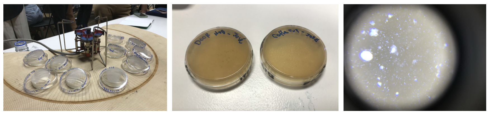
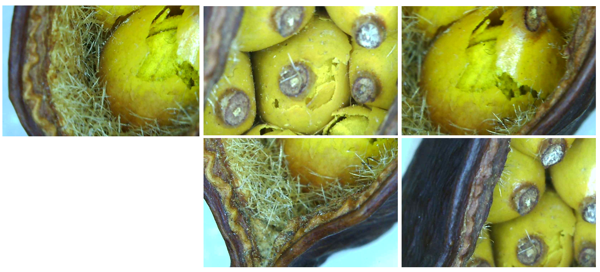
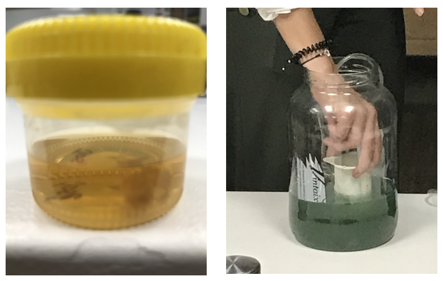
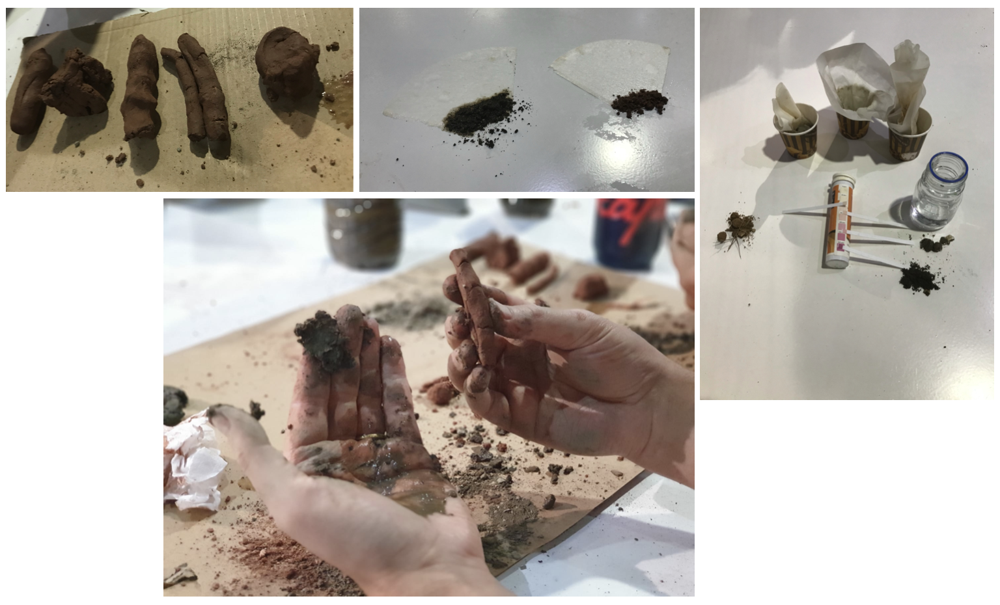
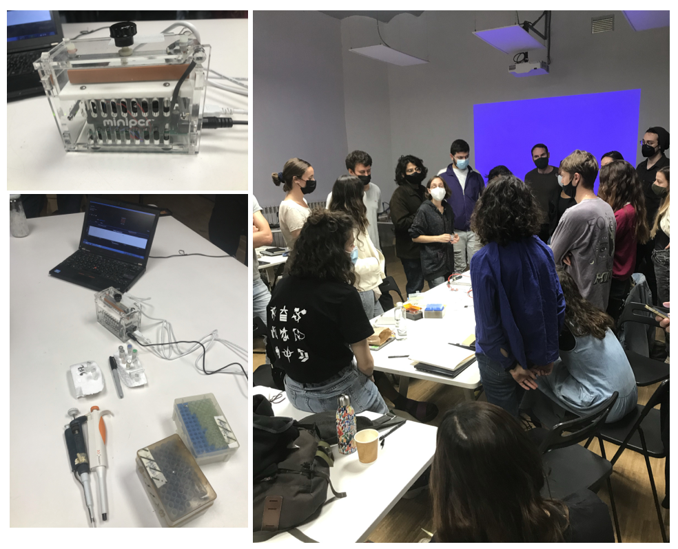

---
hide:
    - toc
---

# Bio Agro Zero

> ## "History is a process of transformation through conversation. In our efforts to produce change, we often forget how important it is to pay attention to what is being conserved" (Humberto Maturana)

The main purpose of these weeks was to understand human existence and the relationship between us and the world that surrounds life. For this, we had the opportunity to experiment with biology tools and some agriculture experimentation. 

**Looking for Micro-organisms**

We cultivated different types of medium to support the growth of micro-organisms. I tried to look for bacteria in the door handle of the class and on my coffee cup, but I made a mistake in the medium I used so very small microbes where seen. 

**Using the Microscope**

I found a seed of a plant tree and decided to look at it with the microscope, discovering nice shapes, textures and colors.

**Kombucha and Spirulina**

As a class we had the opportunity to grow Kombucha and Spirulina using DIY recipes and methods.

**Soil Exploration**

Learning types of soil and their importance: “everything that once lived is now soil” and “soil is alive”.

**Doing a PCR test**
Understanding what is DNA with a "simple" machine.

#### The best: 
the experimentation and DIY tools we used. Also, i loved the world of bees.

#### The Lessons Learned:
- the importance of the hypothesis when doing experiments.
- "design with" the concept shared by Ron Wakkary
- understand microrganisms to understand cultural evolution.
-  New definition of life: any piece of information that can perpetuate itself.

#### The challenges:
- Explore biomimesis
- Do more experiments of cooking some biomaterials.
- Read scientific papers for the "truth"
- Grow something in house.

