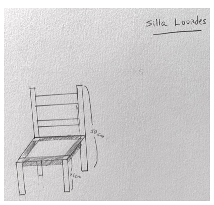

---
hide:
    - toc
---

# Living with Your Own Ideas

> ## "Every great design begins with an even better story "

### The Magic Machines Workshop

The first assignment was to draw ourselves in a sheet. This will be the user or segment of the creation we were going to do. After we had to create "something" with some materials we gathered that were in desuse. 

My magic machine is **a roller coaster** and in the middle there is a figure of a human being.

At first I just starting using some materials that were on top of the table, without knowing what I was doing. I started mixing some discard coffe and a piece of cardboard, and after some time using my hands and exploring the materials some ideas come to my head. I thought about seeing and feeling from different perspectives, so the rollercoaster represents these different points of views and also how emotions change depending on what experience you are living. The rollercoaster never ends, is circular and does not have a "start" or "finish" point, so this is related to cycles in life. The person in the middle represents myself and the bravery to be in the middle of this cycles, exploring open minded and trying to see beyond. 

Some insight that happen during the workshop is that each time I verbally presented my magic machine, I changed or complement my description with more information and thoughts, so when communitating I find new ideas and ways of understanding my own creation. 

After sharing with the group we get to some relationships between magic machines:
- Cycles: we made circular machines and the meaning of **living cycles** was shared.
- Everyone represented the need of **"looking for something new"**.
- The different magic machines showed **many possibilites** about emotions, decision making, ways of being, languages, growing plants. 
- We talked about the concept of **Perception of freedom** as a way of percieving options and possibilites towards life and day living. 

### Emotional Fabrication

I decided to design and **fabricate a chair**, using only what I have at home and trying to do it all by myself. I have never fabricated any furniture (*learning something new*) and also one of my challenges for my new me is to "become a maker" of things (*the first day of my new life*).

- What did I make? And why did it matter?

I started this personal project with the idea of fabricating a piece of furniture for my house, so after investigating a bit about different design and fabrication tecniques I decided that a chair would be a good challenge for an amateur maker.

The first thing after deciding to do a chair was thinking about materials and the type of chair, but before that I decided that the chair was not for me, but for someone special. This chair would be for my just borned goddaughter that is in Chile. This was a point of inflection for the design process, putting a meaningfull objective for the challenge.

I relate this to emotional design and how things provoke emotions on humanbeings. So "simplicity", "cozy" were some concepts for the design, and the main material would be wood. 

I present you a design drawing of "Silla Lourdes":

- What happens when you involve yourself?

The result is not the main purpose of this challenge, but the process of design and fabricating were really important. So I did not finish the chair in one day because of many things happening during the process: Finding the right type of wood in different places around the city. I visited many workshops and shops, trying to find a nice piece of wood at an affordable price. 
In my home I did not have the materials for fabrication woth wood, so after trying to make holes with forks and other thing I had in the kitchen, I decided to ask for help in Fab Lab. Using the machines was a great experience! 

When I involved myself and being in a vulnerable position made me feel different emotions during the process. In other words, this challenge affected me in positive and negative ways. Some of this emotions were: excitement, happiness, anxiety, desesperation, nervious, confident, suprised, which I felt in the same day. I got the support of family and friends, so designing and fabricating with others was important for my mindset and determination. 

- What happens when you use yourself as an instrument?

During all this experience I felt self-challenged with and instrinsic motivation. The first person perspective has been a good approach for understanding and trying to be really empathic. 
The difficulty shows when documentating because you "get out" of the 1PP, so a dilemma of third person and first person appears. 

- Did anything change about your way of working?

As always I started the process thinking to much about what/why/how, so after being overwhelmed with ideas and doubts I decided to "think less and do more". The next morning I woke up and went out to street filming myself and people around me, that´s when the "chair challenge" just got to my head and heart, increasing motivation by doing.

- What does it mean for your future work?

I am interested in emotional design, maker education, sharing with others and social innovation. To fabricate things and use fablab machines is a powerfull new tool for my future work. I am inspired by the maker movement and distributed design as a new way of building and sharing. 

- After seeing the videos of your collective, how does it change your understanding of it, present new opportunities or inspire new possibilities for collaboration?

I enjoyed this experience and to see the resume videos of all my classmates makes me know them in a more deeper way. Each one with their own ideas and styles, similar purposes and causes, but different point of views. 

Here you can see my resume video of the experience: **<https://www.youtube.com/watch?v=_C4YmmYX1FQ>**

### Autoethnography

1. Study Boundaries:
One day to design and fabricate furniture using my own materials.

2. Authenticity:
Design and fabrication for someone special for me. My new me is about "being a maker", and the excitment of learning someting new. Sense of achievement.

3. Plausability or Scholarship:
Emotional design, distributed design, maker education.

4. Criticality:
Using hands and fabrication tools, asking for help, feeling part of a maker community, investigation about designing wood objects.

5. Self Revealing Communication:
Making the video for a third person puts me out of my 1PP, so there is a dilemma when documentating the process. 

6. Ethnographic material with Confessional Content:
Over thinking (too much head) and the difficulty of making decisions. 

7. Generalizability:
The possibility of fabricating your own things and designing for others: family and friends that are away can recieve your gifts. The feeling of giving and recieving.

#### The best: 
The opportunity of doing without pre-thinking. 

#### The Lessons Learned:
- Any creative action is always situated.
- The magic machines methodology is good for activing your imagination because you enter without knowing what you are doing and the process starts making sense and ideas appear and thoughts organize.
- Design simple in a way that is understandable for all. Do not get "in love" with your ideas,be open minded to recieve feedback, and have the courage to change.
- Ask for help when needed: the maker space is a community when everyone can help you. 

#### The challenge:
Finish the chair and continue fabricating things.

