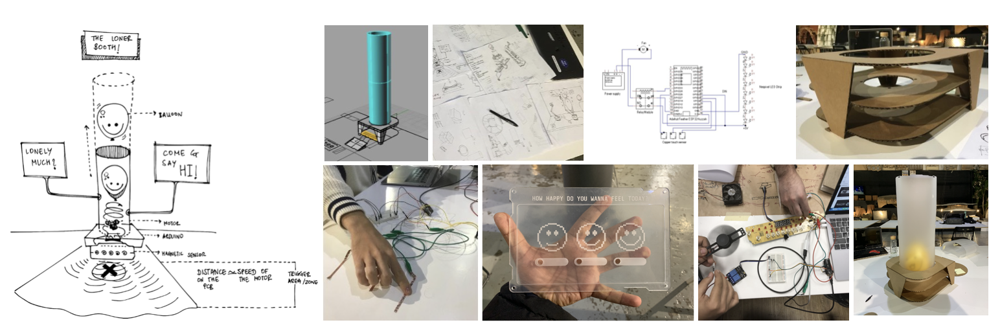

---
hide:
    - toc
---

# Tech beyond the Myth

> ## "Just because something doesn’t do what you planned it to do doesn’t mean it’s useless"

### Forensics of the Obsolescence

In teams we had the opportunity to **disarm a television**.
I had never open a tv so it was an exciting activity which make me discover a whole world inside this black box.

 
 This is a link to our forensic report: 
**<https://hackmd.io/k6mQVyogRHG1THKUaOLR9g?view>**

Final thoughts after the activity:

- Fab for Economics vs Fab for Environment: The traditional mindset about the economic model makes the “cost/benefit” the main purpose of the industry, leaving long term purposes (environment contamination, carbon footprint, recycling and reutilization) aside. The challenge for this type of products is to start producing in a circular economic way.

- Black Box (TV) has inside black boxes that have inside blackboxes that have inside blackboxes: The understanding about machines that are made of smaller machines, each one with their own utility, is a interesting fact when fixing or reinventing products. In the case of this TV, we had a lot of black boxes that could be used for fabrication of other type of products.

- The difficulty of disassembling it without breaking it: Disposable products, not made for fixing at home, is a paradigm that is changing. In today´s world the concept of DIY is attached to the way humans and things are related.

- The industry managed to settle products for different public using the same boards: Low cost and simplificity for production is exemplified, fabricating different models for different public using the same “materials”.

- It’s not that the TV did not work, it was only the the black LCD screen: Can the client replace the screen?, or is too dangerous?, or is not favorable for the industry?.

### Measuring the World

In teams we had the opportunity to make a **physical intervention**. The topic that we were interested was about *how to make safer cities* focusing in *gender expression*.

We wanted to make people think of their awareness about gender expression and answer some questions regarding gender pronouns.This happened in a personal space (bathroom), so people feel confortable about their answers. The interaction was anonymous.

This is the link of the Sense-Making Journal: 
**<https://hackmd.io/EtXk_eLfTmeD98oJX0lKrQ>**

### Useless Machines

In teams we had the opportunity to design a **useless machine**. The concept we developed was about *feeling lonely* and the main question was: *Can a machine aid loneliness?*

##### The Loner Booth
People´s need for inclusivity and feeling connected (be part of something) is adressed in this machine, where you can interact and get a smile (from the machine and from yourself).

Design, electronics and fabrication process:

Prototyping and storytelling:

Human reactions (smiles):

In this link is the *video*: **<https://youtu.be/VGzSk2XlD3k>**

In this link is the *presentation*: 
**<https://docs.google.com/presentation/d/1R_QlpASGupockWAJxV_IFKaKJ-OMxydYArBRfEmzGw0/edit#slide=id.p>**

Creating a useless machine was very useful for understanding the process and through out my own documentation I can reflect and share some abstract, deep and poetic personal thoughts:

1. Connect the time. Figure out how to construct it. Remember to standarize some thinking.
2. Everything looks simpler than we expect. That contains impact that we have to master.
3. You are abstract. A small taste to be humble. We feel.
4. To interact differentiating people´s awareness deceives problems.
5. Binary techonolgy affects expression. Opinion can be wrong.
6. Usefull for you is what we call a useless feeling.
7. Everyone better talk. Try so.

You can see the video of this documentation process here: 
**<https://www.youtube.com/watch?v=oPLxU-qrUXc>**

#### The best: 
- Putting in action electronics and fabrication. It is great when machines work!

#### The Lessons Learned:
- Errors will be present in all projects. Do not try to avoid them, but learn how to identify them.
- Team organization is crucial for the efficiency of the project. Everyone can not do everything. Define roles and know the strenghts/weaknesses of each one.
- Do not believe everything that you measure. The balance between majorities and your own beliefs is important. 
- The making process is a good way of validating assumptions. Theory can make mistakes.
- The final result makes humans acomplished and proud, but process is much more sginificant for understanding. 

#### The challenge:
- Stay humble in a design and fabrication process.

