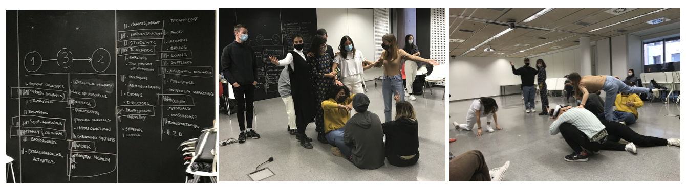
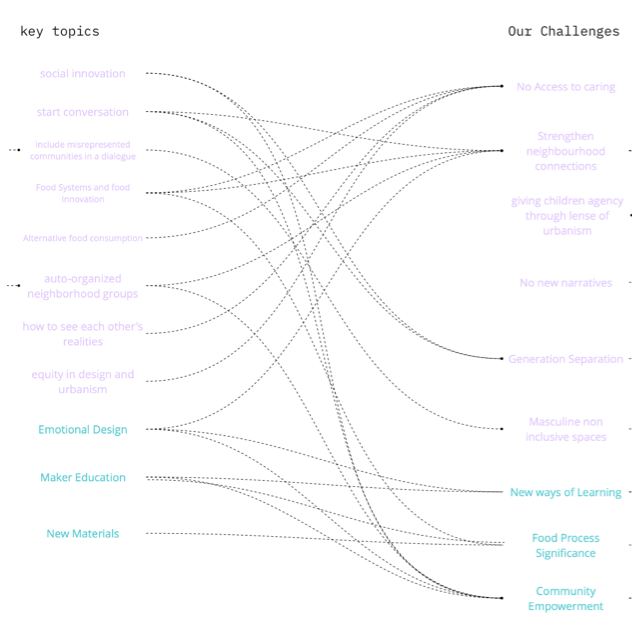
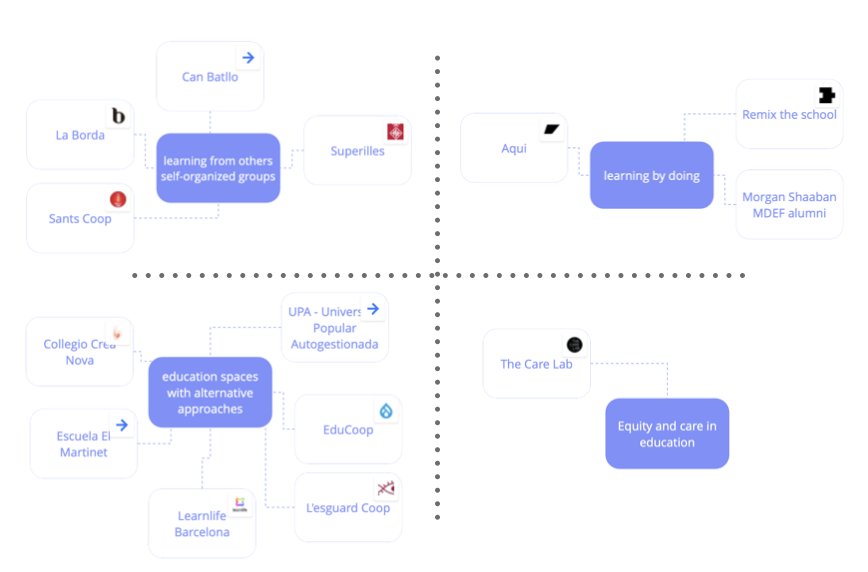

---
hide:
    - toc
---

# Community Engagement

> ## " We are all actors: being a citizen is not living in society, it is changing it."

During this week we started situating our research and understanding the "social body", with a practical approach:

### Look Around : My Call vs What is Emerging

**What is urgently waiting to be born in the world?**

- Communication and understanding (empathy)
- Acceptance of difference
- Belief and construction of places we are all part of (sense of community)

**What evidences can I find around me supporting the urgency?**

- Immigrants are not allowed
- We don´t talk about how we are (emotions and feelings)
- Loneliness and depression
- Extreme political views (example: Chile´s situation)
- Economic growth vs Sustainability
- Lack of education opportunities and justice for all.

**Which glimpses can I find in the present of those futures waiting to be born?**

- New associations of neigbours and communities (example: Can Batlló)
- "Vida de barrio"
- New policies about immigration rights and multicultural cities
- New economic mindset (example: B corps)
- Protest in the streets, people want change (example: Estallido Social Chile 2019)
- Concept of cosmopolitan localism: SLOC (small, local, open, connected)

### Sculpture of Bodies

To use theater as a tool for creating and understanding systems is special for me (connecting a discipline that inspires me). It is interesting how we become conscious about each part of our body (self awareness) and how "putting bodies together" can show a reality (4D mapping).

When doing this exercise, the actors and the spectators have a leading role in their perspective. The relationship between the internal and external vision about the act, and the communication between both, makes the reality more understandable. Also, it makes us aware about what you see is not always what is really is. There is not a true reality, but different ways of understanding it.

### Local Ecosystem Mapping (from ego to eco)

As part of the "Unlearning to learn group" we had the assignment of designing a collective intervention (read more about in design studio term 1).

*Our Collective´s Challenge*:

**We studied in systems created by the needs of previous generations and led by them.
Today's needs changed and the hierarchy in teaching and learning should change as well.**

- How can we change what we learn and how we learn it?
- How can we create new ways of learning, by raising our voice and showing our needs?
- How can we be aware of those needs?

*Identifying the local ecosystem*:

To see our complete work click here:
**<https://miro.com/app/board/o9J_lghcdZA=/>**

#### The best:
- Using theater as a tool for creating and understanding realities.

#### The Lessons Learned:
- What we give attention, it grows. So let´s focus our attention in the important things. 
- We can change the reality by changing the inner place, so start from something little.
- Mapping the ecosystem is a good way of understanding "who cares about what I care".
- The concept of "wicked problems": every situation is unique so you can not define it from a top-down method. 

#### The challenge:
- Map the system and start meeting interesting people related to "what I care about".
- Research and explore about "Teatro del Oprimido".

