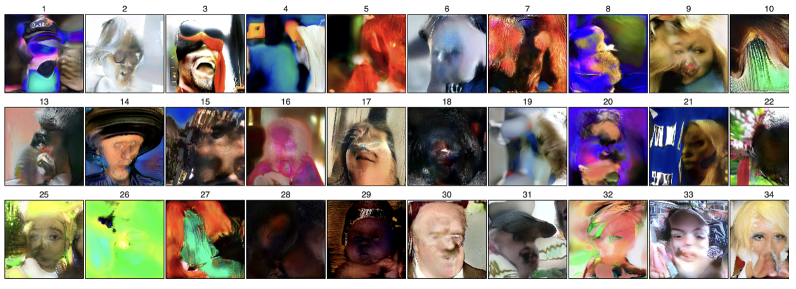
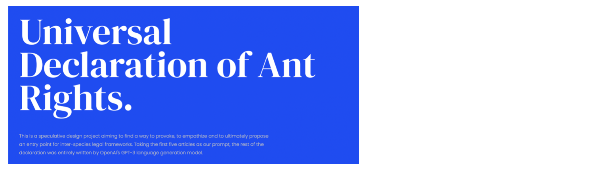
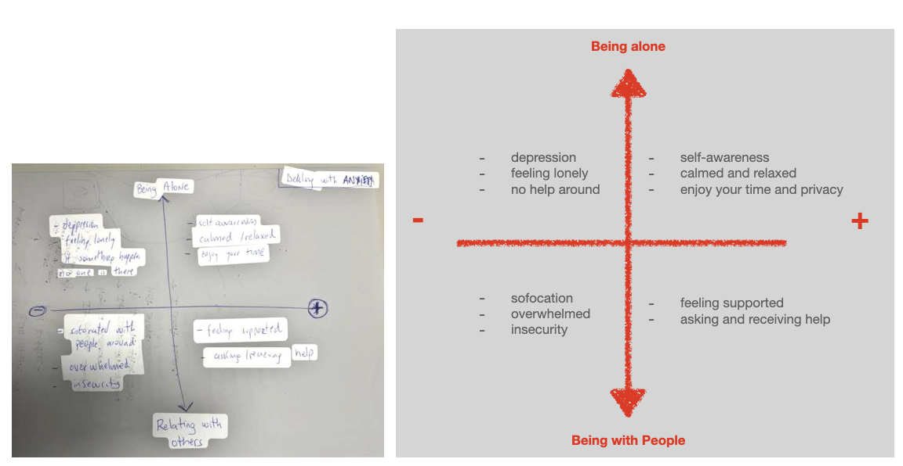

---
hide:
    - toc
---

# Extended Inteligences

> ## "The measure of intelligence is the ability to change" (Albert Einstein) 

During these weeks we started exploring artificial intelligence by introducing some new concepts such as: machine learning, neural network and data sets. 

This was an exercise with an image generator net, where each one collect 100 pictures of the Poblenou neighbourhood and the last 100 pictures of the phone. For me it was interesting to understand that we decide: what we want to do, the data set we use and the network we use, but we don´t decide how the net autoconfigures itself (concept of blackbox).

Playing with the neural network of human faces: 

### Neural Networks: Universal Declaration of Ants Rights

Human beings are not the center of the world. All animals that exist, including small insects, should have rights. So, we created a document that refers to all the rights that ants have.

We are using GPT-3 (Generative Pre-trained Transformer 3), a third-generation language prediction model by Open AI.

1. No ant shall be arbitrarily deprived of his or her liberty.
2. Each individual ant, whether it is worker, drone, or queen, is unique and different. All are entitled to the same rights.
3. All individual ants are equal before the law and should be treated equally.
4. No beings are allowed to interfere with the integrity of an ant colony. 
5. All beings are liable to be prosecuted in the Universal Interspecies Court for violation of ant rights. 
6. No ant colony may be destroyed or in any way harmed without a court order. 
7. No treaty may be signed which deprives ants of their rights as an independent species. 
8. The Universal Interspecies Court must have the power to impose appropriate penalties for violation of ant rights. 
9. All beings are prohibited from interfering with the free exercise of the ant religion.
10. All beings are required to respect the environment of ants and all other beings.
11. All beings are required to encourage the preservation of ant diversity.
12. All beings are required to abide by these Universal Ant Rights in so far as they respect the independent nature of ants and do not interfere with them.
13. All beings are required to make their best efforts to ensure that the environment of ants and all other beings is protected.
14. All beings are required to encourage peaceful coexistence and the pursuit of harmony between ants and other beings. 
15. All beings are prohibited from interfering with the life of an ant colony or any of its members.
16. All beings are prohibited from making use of any part of an ant colony without the permission of the ants.
17. All beings are prohibited from interfering with the environment of an ant colony or any of its member. 
18. All beings are required to abide by these Universal Ant Rights in so far as they do not interfere with the free exercise of the ant religion and do not violate the integrity of an ant colony.
19. All beings are required to report any violation of ant rights to the Universal Interspecies Court.
20. All beings are required to uphold this Universal Declaration of Ant Rights.
21. The Universal Interspecies Court has the power to impose appropriate penalties for violation of ant rights.

The above tewnty one ant rights were formulated by the Ant Rights Project as a basis for further discussion and as a means of protecting ants from human exploitation and abuse. The Ant Rights Project has also developed a draft treaty which would be submitted to the United Nations to prohibit human activities that interfere with the freedom of ants.

**Wacky Reflection:**
What do ants think about their rights? What is their opinion? Is there a way to communicate with them? To get further this assignment we could create a form of communication with ants, so they can comment about their own style of living and what rights they think deserve. For example, an idea for this communication between humans and ants could be by the speed they walk and what figures are built by their footprints when walking.

For further information about our project see our website: **<https://antrights.com/>**

### Designing an Intelligent Object: The Anxiety Ring

We live in a world where everything goes faster than before. We humanbeings are focused in the future, in what is going to happen, not paying attention to what is happening right now (the present). Also sometimes, we start remembering the past ("all the times past was better") feeling nostalgia. 

As a group we started discussing about what has been some episodes in our life when we have felt anxious. Is anxiety real? 
More over, after the pandemia that affects everyone, we are learning again how to relate with others an live in a social world. So the scenario for our assignment is: COVID INDUCED ANXIETY AT AN AIRPORT. 

Our objective is to design **a small wearable that helps alleviate anxiety and warns your close community.** 

Why a ring?
1. Personal and almost invisible wearable that does not expose the user. 
2. Information gathering by object attached to hands (blood pressure, heart beat, temperatura, sweating, movement).
3. Unique and important, so as own health awareness. 

The futures of this intelligent object are: locating safe spaces, anxiety detection and message support. All this connected to a mobile interface that records data (ECG, location,noise Level, motion, temperature). 

As part of the user experience: adjustable sizes, synz with app, designed for fidgeting, connects wirelessly and releases anxiety medicine when chewed.

The goals for the object are: 
- self-awareness
- calmness
- mood stability
- safety
- independece
- privacy

Some consequences could be: addiction, reliance, over sharing, exposure and infringement. This is a temporary solution for anxiety but not a permanent solution for mental health and anxiety disorders. 

**Value Mapping: comparing how you deal with anxiety when you are alone versus when you are with people around.**

#### The best: 
- Exploring neural networks and analyzing the scope of machine learning.

#### The Lessons Learned:
- There is not a one true definition about intelligence.
- Machines and humans have many things in common, but also many different things.
- Animistic design as a method for encouraging human and non human relations.

#### The challenge:
- Research about how machine learning and emotions are related.

