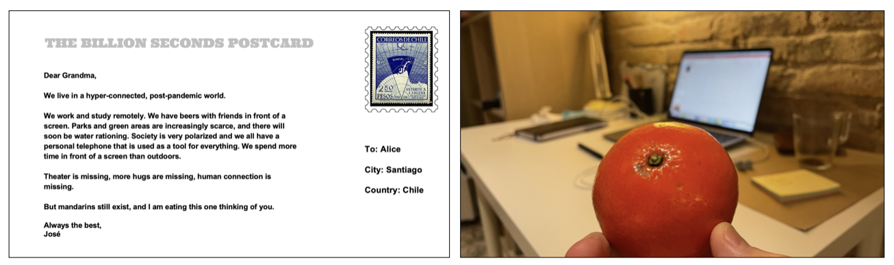
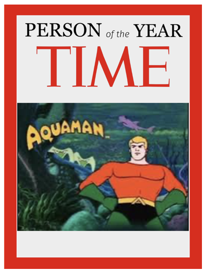
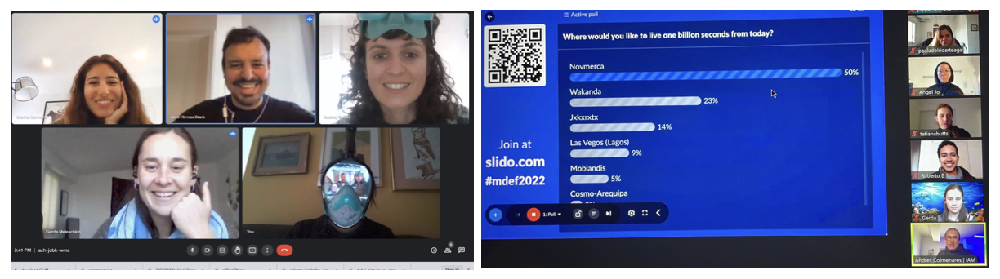
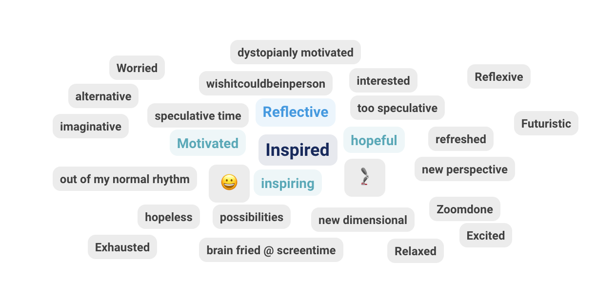

---
hide:
    - toc
---

# Designing for the Next Billion Seconds

> ## "A bad idea: teaching humans how to code and machines how to *learn*" (IAM Creative Research Lab)

First of all, let me clear out: 
#### 1 Billion Seconds = 31.7 years 

**The melting world (for inspiration): <https://youtu.be/xsBV5k7VWII>**

During this week we discuss and reflect about future(s), time, the everything, technology, human beings and the planet, making important questions that triggers:

*"What futures do we want to remember one billions seconds from now?"*

### WTF is...

**Future**
An energy that makes us wake up everyday ang give meaning to existance.

**Internet**
Internet is a non-biological extension of the human brain, capable of memorizing, thinking and communicating. We humans became ambitious about knowledge and industrial development. So in a chance in trying to control what is happening, developed a way to stay full connected with everything and everyone. Internet is a way to make life more certain.

**Time**
We defined time as a human invented measurement to understand existence. But time is not about life, it is about everything that is happening, happened and will happen. So it is a “thing” that is always present and is part of everything.

**Everything**
The opposite to nothing.

### The Billion Seconds Postcard

### Person of the year 2052

Human being relationship with water is critical. Water would become the main resource and a symbol of wealth. We need to conscientize about water use in this climate emergency.

### Earth Day Speech: city of Novmerca

*Water:*

Our planet earth is one of water. In fact, 71% of the surface is water, the ocean holds 96.5% of all earth’s water, and our own bodies consist of 60% water! 

Novmerca is situated in the Caribbean islands so according to IPCC predictions, there is a high confidence in sea level increase by 2050.
We have been anticipating this situation for decades with new technologies to build and sustain floating cities connected to the initial island.

As you can see, we live on a water planet. Our goal is to see how we can transform the way we live life to have a more horizontal relationship with water.

One of our major propositions is how we’re going to procure drinking water for our citizens since rainfall is also predicted to decrease. We plan to do this in these ways:from condensation in the humid air, using systems to convert sea water to potable fresh water.

We also want to ensure that our water policies are benefiting not only the citizens of Novmerca and our island, but surrounding nations and sea life. We will do this by implementing an exchange fresh water policy where we can offer our clean filtered water as a resource, we want to focus on protection of water species, water cooling system using hydro energy (water AC system), implement water recycling systems

Is your city dry? How do you manage to get water?

*Migration:*

On our island it will happen that people will emigrate. The sea level is rising and the area of our mainland is decreasing. The projected net population decline is currently diminishing. But of course we are open to immigrants. We are welcoming climate refugees facing similar aquatic challenges with our floating SEATY technologies. We are ready to acquire - 50.000 people. Also we are offering workshops and opensource data to better integrate and build your own shops/houses and floating parts. We are very happy about new ideas and give everyone the chance to get involved. 

An open source plan to build floating cities. This sounds nice right? Who would participate? How can we build a network between them?

*Data Governance:*

At Novmerca, we have developed a participative data transparency policy with an open data platform to give access to all the citizens and environmental data. All the administrative tools are open source and every citizen can see the algorithms behind them and propose improvements. 

Citizens play an active role in data collection. Everyone can ask for a sensor kit from the city. Citizens also share data on their techniques and make them available to everyone (for example : Construction plans for Floating buildings, methods to produce drinking water, instructions to grow vegetables - Aquaponic)

We don’t only give access to this data but encourage citizens to use it and collaborate with them to create solutions! We have DATADIAS every week, where citizens can physically meet and discuss or co-create solutions based on Novmerca data. It has helped us anticipate many crises and this is how we are in this situation today.

What if we extended this strategy at a bigger scale than just our city?
It would benefit everyone if we had a cross-city strategy and were able to interconnect our data.

*Wealth Concentration:*

Our island has defined environmental justice as a main social value, redefining the concept of economy: “when one wins, we all win”. The economic model of the city is based on cooperativism, so each citizen is responsible for a part of the island. The percentage of responsibility is calculated depending on sustainability factors and the relationship of each human to nature in the long term.  
 
Wealth is measured in terms of our connection with nature and sustainability with the environment. For example: the less materials you use, the richer you are, and more participation in the decisions of the island you can make. 
 
The importance and assessment of careers and jobs is adjusted to environmental issues, and everyone receives a worthy salary. We propose the 10X Policy, so for companies the top salary is no more than 10 times the minimum salary. 
 
Looking for the best for the world, we think a global currency will make us all aware of the main challenges that we are facing, worrying beyond the borders of the nation, and seeking a common good for the planet. If money is what mobilizes people: should wealth be in the environment instead of money?

*Nightlife:*

As citizens we would like the nightlife at Novmerca to contribute to our country. We think nightlife has been an important part of life for thousands of years. 

But at Novmerca we would like to propose parties of impact where the energy product on the dance floor helps with the courtesy green energy state. We would like all parties to involve headphones to reduce sound pollution and we will dance to the light of the moon. As Novmerca is a city on the water we are researching ways to use spaces underwater to have underwater parties. 

We would like to leave you with this question: shall nightlife contribute to your city's energy too???

#### The best: 

Discussing "what if" scenarios and having the opportunity to listen to my classmates reflections about the futures.

#### The Lessons Learned:

- How to use questions as design tools (what if...)
- The concept of design as a verb (action)
- " The future " does not exist. It is a plural concept (futureS)
- The narratives that we create are powerful, words shape realities
- The everything manifesto (IAM): we should design for humbleness, responsability, plurality, solidarity, empathy and tolerance.
- The concept of circadian organism and degrowth. There is a crisis of imagination about how we measure success, life and development. 

#### The challenge:

Use speculative design to discuss and reflect (enable changing status quo).

