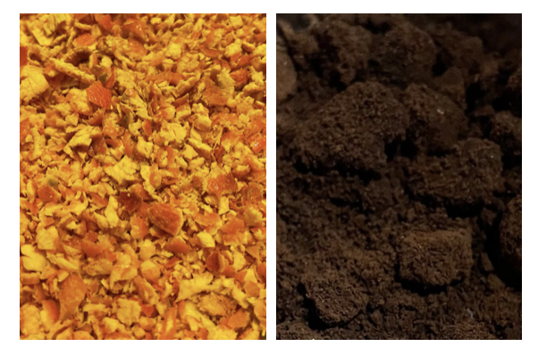
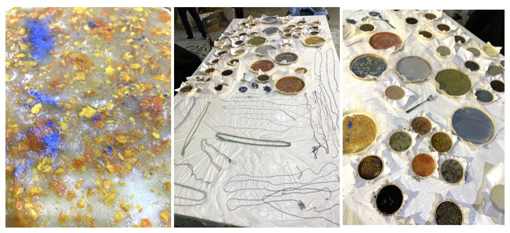

---
hide:
    - toc
---

# Exploring Emergent Technologies

> ## 

## Remixing Materials (part one)

### Inspiration 

S-biotica, Remix el barrio, Anthropocene geology (nuclear explosions and plastiglomerates), MIT Media Lab, Dasha Plesen. 

### Food Waste Manipulation

During this seminar we were introduced to biomaterials and had the opportunity of experimenting using different food waste. 

- Connect: Tangerines and coffee are part of the basic food I have almost everyday. I choose this materials for experimentation because it is a usual material (available almost everywhere) and there is oversupply in Barcelona. 
- Collect: During one week I collected the coffee grounds (of the coffee I drinked) and the tangerine peel in different glass jars.
- Dry: I used the oven for drying the food waste, putting the temperature low (50-70°C). The tangerine got dried and after I grind it. The coffee did not get so dry. (I loved the smell of my flat after using the oven!)

### Material exploration and properties

In groups (with Aparna and Joaquin) we did experimentation of biomaterial recipes:

#### Gelatine

- 20gr gelatine
- 250ml water
- 15gr glycerin
- 2ml vinegar
- 30gr aditives

*Properties:* renewable resource, hydrolyzed collagen derived from animals, local - waste from the meat, pork & fish industries, compostable, industrial use (gastronomy, medicine, farmaceutic).

#### Pine Resine

- 45gr pine resine
- 15ml alcohol
- 5gr carnauba wax
- 40/60gr food waste

*Properties:* renewable resource, natural resin derived from pines, local - Catalunya, antibacterial, biodegradable, 
industrial use (paper, adhesives, paintings, coatings, farmaceutic).

#### Other biomaterial experimentation

It was the first time I experiment with these type of biomaterials and I was impressed by how the process is determined by handcrafting, in a way very similar to cooking food. Each ingredient amount, the heating temperature, the mixing order of each ingredient are significant things for the final result. For this reason, every small change affects the outcome. 

The material design properties are also essential to understand possible applications so it is not only about the fabrication process , but also to complement this with technical, functional and emotional research about the material that you are exploring.

In the material scarcity moment that we are facing as humanity, it is necesarry to keep on looking for alternatives that can be sustainable, being aware of their properties and potential use. The biomaterial production is highly determined by the local waste, making difficult to transform this alternatives in industrial production without harming the environment. For example: in Spanish coasts there is abundant Agar Agar or in Chilean coasts there is abundant sea shell, so each local biomaterials experimentation should use mainly this type of wastes. 

It is interesting to think the design of new products limited by the use of local biomaterials. This could open new insights for product outcomes and new innovation design opportunities. What if each product was determined by the excess of materials that are available in the near sorroundings?How many alternatives for the same final product can we imagine?

## Remixing Materials (part two)

### Materials in Context 

Around Poblenou we started searching for different material opportunities: human hair, coffee grounds, orange and other fruit peels, mejillones, meat and poultry oil and bread crumbs. 

We decided to work with **Bread Crumbs** because:

- Many supppliers around the city (in Barcelona there is almost one bakery in each street)
- Common and simple material with a high offering amount
- Research about the bread loss: <https://foodwin.org/wp-content/uploads/2018/01/Factsheet-Bread-Waste.pdf>
- Few biomaterials projects related to bread

#### Material SWOT Analysis

#### Cooking Process

Two different recipes:

**Recipe #1**
-10g gelatin
-125 ml water
-7.5ml glycerin
-2ml vinegar
20g breadcrumbs

**Recipe #2**
-25g Pine resin
-40g breadcrumbs
-15ml alcohol
-5g carnauba wax

#### Lifecycle of the material

#### Results and Applications

- Bread crumbs surplust in bcn (“almost a bakery per street”)
- The format of the food waste has to be passed through a process before making the biomaterial.
- Opportunity for designing new projects (it can be eatable).

#### The Best: 
- The cooking process freedom of exploration and the surprising feeling to see, touch smell (and taste) the final result. 

#### Lessons Learned:
- To understand the technical, functional and emotional properties is important when defining biomaterials for design. 
- Material Library: Materiom
- Exploration (doing) is an important process for imagining future applications.
- The context affects the type of material that you can use, for making a sustainable fabrication process. 

#### The Challenge:
- Keep on trying different recipes and mixing materials for emerging new materials.

## Collective Intelligence

