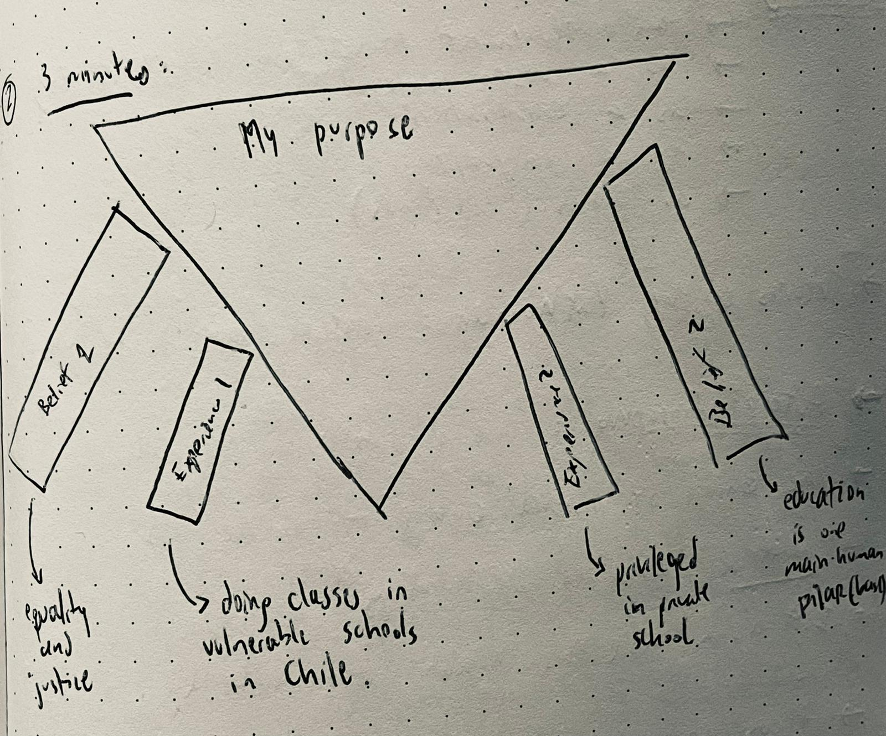
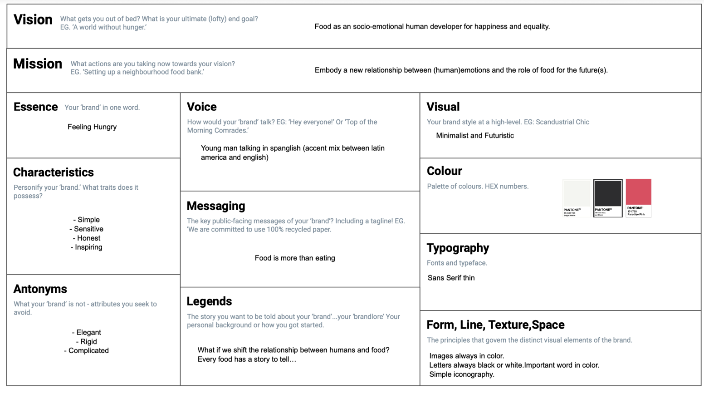
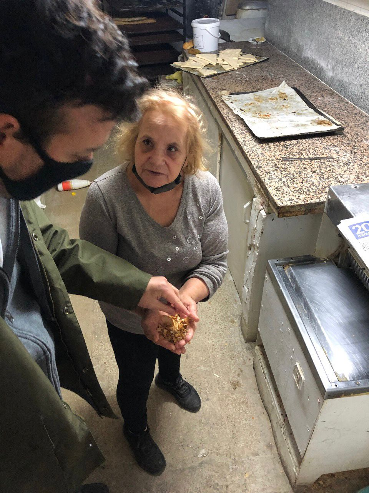
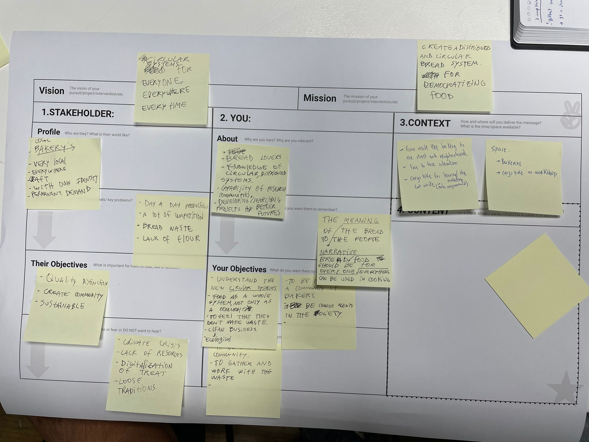

---
hide:
    - toc
---

# Communication, Brand and Purpose

> ## "Authenticity is allignment of head, mouth, heart and feet -thinking, saying, feeling and doing the same thing- consistently"

During this seminar we have the opportunity to explore methods for generating meaningful ideas and projects, starting with ourselves. The most difficult challenge here is to really connect with "my own why" and use this as the starting point. In this context, I find very interesting to think about my role as a designer, trying to be consecuent between the things I do, I think and I feel. We discussed about some brands example that try to do this, and in the other hand the awareness about brands that still have only a financial objective. For me, authenticity and honesty is essential when communicating between people, so as for brands that need to be credible and consecuent too. 

### Exercise #1 (30 seconds): Why I am a designer for emergent futures?

Seeking alternative ways to improve life (sense of justice)

### Exercise #2 (3 minutes)

Belief 1: equality and justice
Experience 1: doing classes in vulnerable schools in Chile

Belief 2: education is a human development tool
Experience 2: my own education at school (feeling privileged in this).

### Exercise #3: My Brand Canvas

### Exercise #4: Headline for 2040

- Headline: World Wide Bread
- Sub Holder: Distributed circular food system that connects people and ends hunger.

### Exercise #5: The Pitch

We constructed the pitch for a biomaterial exploration we made with Joaquin with bread crumbs. For this we went to a bakery next to IAAC and met "Visitación", an old lady that told us part of her story, her needs and dreams. With this we make a pitch based on her story, trying to communicate in an honest, direct and emotional way, showing the importance of bread and local bakeries for social development. 

#### The best: 
- Make communication happen and reflect about it. I feel I need to communicate with others for my personal development, so always searching for new ways , and also exploring what communication means for non-humans, for things, for the relationships between they/them, and how communication is a powerful tool for creating realities.

#### The Lessons Learned:
- Keep it Simple Stupid (KISS): how we communicate is really about being clear and not complicated. It is about telling a story. 
- Honesty and authenticity are essential concepts when constructing a brand. 
- Start with your personal "why". The "what" and the "how" will appear later.

#### The challenge:
- Rethink my personal brand that reflects my purpose, my work and my process.

 

