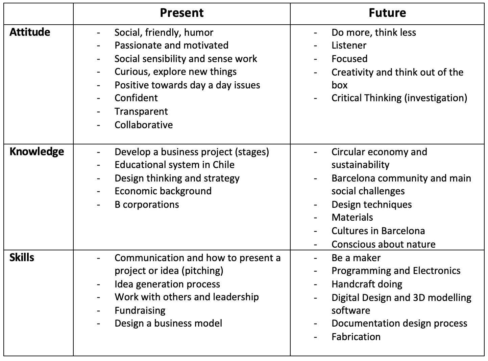
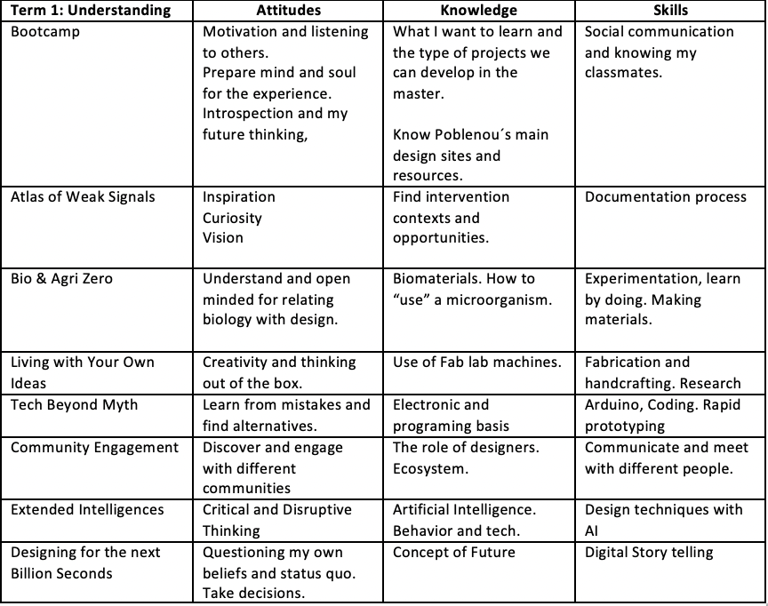
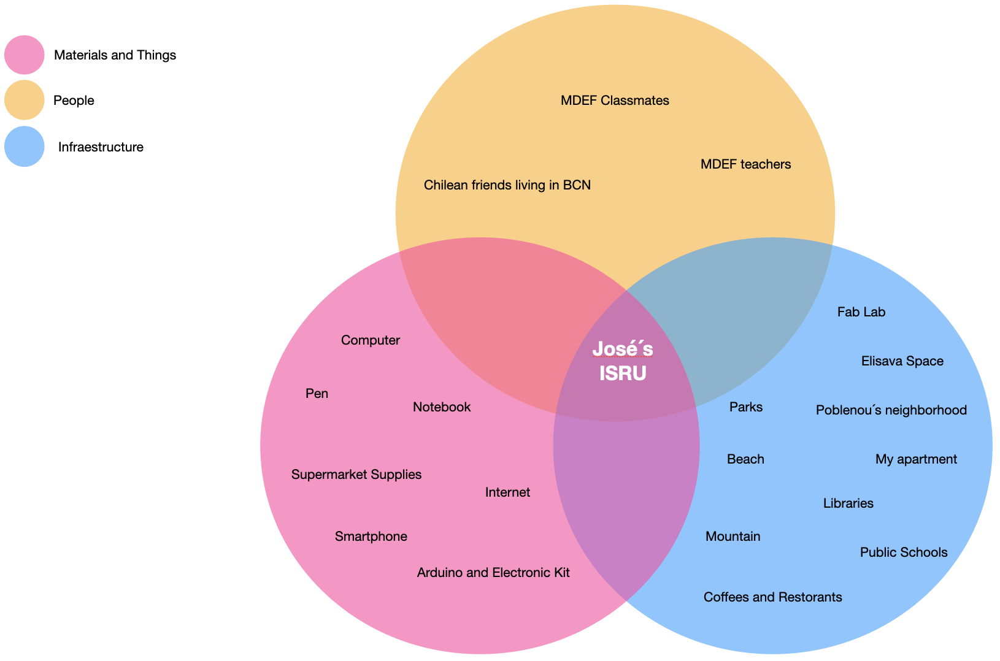
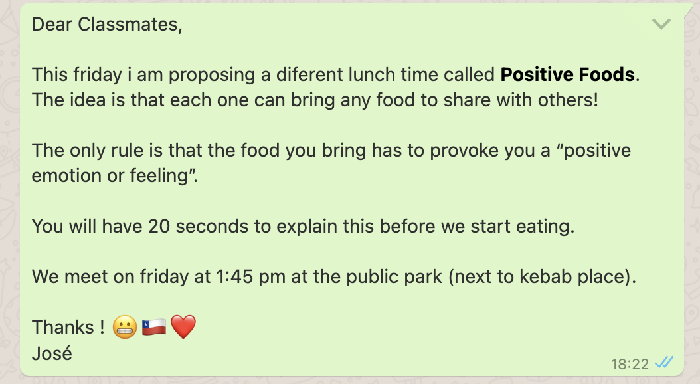
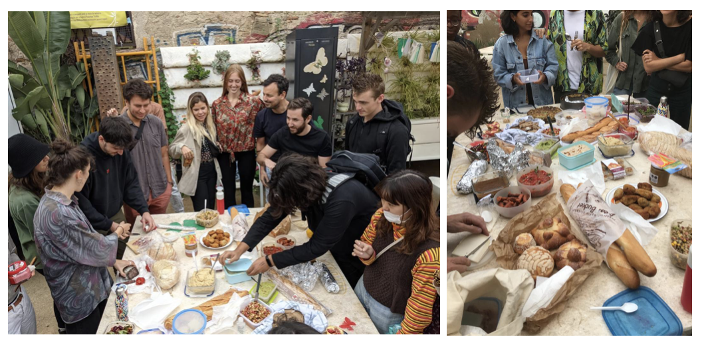
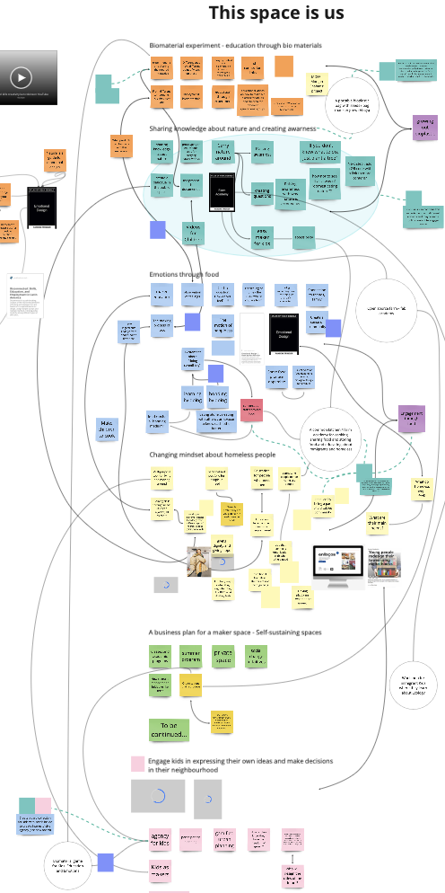
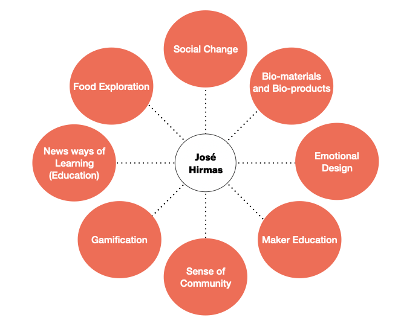
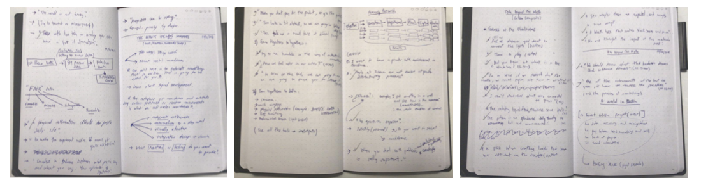

---
hide:
    - toc
---

# Design Studio 1

**Design vision of how our (social) world could be in the (near) future:**

My vision is to generate spaces for human relations and their educational and social development, empowering in the need of being part of something, accepting each others realities, empathizing, sharing and creating community as a main concept.

**Personal Development Plan**

 

**What I want to learn and develop?**

 

**My New Me**

To construct my design and creativity attitude I got really inspired by Nasa´s I.S.R.U (In Situ Resource Utilization) and I am applying some methods that artist Tom Sachs defined as part of his creative way: output first thing in the morning, do what you love, setup is everything, start easy, patience, forgive yourself of perfectionism, make to do lists. 

**Experiment 1: Positive Food Lunch**

Role of Prototyping: Means of Enquiry
The purpose of this experiment was to explore the relationship between food and emotions for people.  Also to explore “making” food as a process and the changes in the materials (shape, color, taste, etc) when cooking.

I invited everyone in the class to bring their foods to share with these indications:

I choose to make **Choripan con Pebre**: this is a traditional Chilean informal dish that we use to eat in barbeques, when gathering with friends and for celebrating important dates (such as the Independence Day). The plate is composed of: Bread, Chorizo, and the sauce called pebre has tomato, onion and cilantro.

The day of the experiment almost all the class participated, many exciting faces and positive comments about the idea. There was a lot of different food!

Meanwhile everyone was eating and sharing I made some short interviews just to know the feelings and thoughts about this food experience. In this link you can see a resumed video of the experiment: **<https://www.youtube.com/watch?v=qH2-d3UDoYI>**

#### Conclusions:####
-   Everyone related their food to some special memory of their local town/city. It was surprising that almost everyone brought something of their country.
-   During the experience you feel “the joy energy” surrounding us. Also the sense of community and the “sharing” took place as the key element of the experience. 
-   Food produces happines ? I will have to explore types of food and what produces in organism (serotonine, dopamine).
- Many people asked me if we are going to repeat this experience, as a tradition. 

**My Interests**

After sharing interests with my classmates, we were grouped together in "Unlearning to Learn", talk about experiments, ideas and new "to do things". It was very good seeing the touchpoints we have with each other:

This week I get really empowered with Ron Wakkary's seminar about post human centered design, specially with the concept of **"design with"** which makes me wonder about how my design project has to be developed with relationality between humans and things. 

We don´t design alone, we need to negiotate with others.

**Documentation beyond Presentation**

When documenting we represent the world with our own perception. In this way, documentation is not apart from our 1PP but is part of the process. 

Through my experience, I have been with "my senses open for exploration". The tools I am using to document are very simple: notebook, pen and phone (for pictures and videos). In my notebook I use to make visual maps of the concepts and ideas. 

I am experimenting in the documentation process by paying attention to the words and concepts that everyone use in my sorroundings. This has make me focus in language and word usage to understand what is happening around. I am using my notebook to write the exact sentences of the concepts and ideas that I want to capture. So everyday I have between 5 - 20 phrases of people (including my own sentences). This sentences are transformed into quotes. 

The text input is cronologically captured transforming sentences into small "quote stories". Each sentence has a choosen word or concepts that is used for making a final quote of the story. 

The result is an abstract, deep and poetic quote summarizing the documentation process.

In this link you can see *"Words that Create Realities"*: <https://www.youtube.com/watch?v=oPLxU-qrUXc>

